# Architecture — JokiIn Platform

## Daftar Isi

1. [Overview](#1-overview)
2. [High-Level Architecture](#2-high-level-architecture)
3. [Monorepo Structure & Boilerplate](#3-monorepo-structure--boilerplate)
4. [Frontend Architecture](#4-frontend-architecture)
5. [Backend Architecture](#5-backend-architecture)
6. [Real-time Architecture](#6-real-time-architecture)
7. [Database Architecture](#7-database-architecture)
8. [AI Architecture](#8-ai-architecture)
9. [Payment Architecture](#9-payment-architecture)
10. [CMS Architecture](#10-cms-architecture)
11. [Infrastructure & DevOps](#11-infrastructure--devops)
12. [Security Architecture](#12-security-architecture)
13. [Monitoring & Observability](#13-monitoring--observability)
14. [Scaling Strategy](#14-scaling-strategy)

---

## 1. Overview

JokiIn dibangun dengan arsitektur **modular monorepo** yang memisahkan concern secara jelas namun memungkinkan code sharing antar packages. Setiap service bisa di-scale dan di-deploy secara independen.

**Prinsip Arsitektur:**

- **Type-safe end-to-end** — TypeScript dari database (Drizzle) sampai UI (Next.js), shared via packages
- **Real-time first** — Socket.io + Redis Pub/Sub untuk semua interaksi yang butuh respons instan
- **Escrow-safe** — Semua transaksi finansial menggunakan PostgreSQL ACID + idempotency keys
- **AI-augmented** — Claude API untuk intelligence, bukan gimmick
- **Edge-ready** — Cloudflare di semua lapis, Hono kompatibel dengan edge runtime

---

## 2. High-Level Architecture

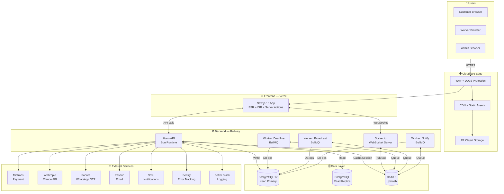

---

## 3. Monorepo Structure & Boilerplate

### Root Configuration

```
jokiin/
├── apps/
│   ├── web/                    # Next.js 16 frontend
│   └── api/                    # Hono + Bun backend
├── packages/
│   ├── db/                     # Drizzle schema + client
│   ├── types/                  # Shared TypeScript types
│   ├── validators/             # Zod schemas
│   └── ai/                     # Claude API wrapper
├── workers/
│   ├── deadline/               # Deadline timer worker
│   ├── broadcast/              # Matchmaking worker
│   └── notify/                 # Notification worker
├── docs/                       # Semua dokumentasi
├── .github/
│   └── workflows/
│       ├── ci.yml              # Test + lint on PR
│       └── deploy.yml          # Deploy on merge to main
├── docker-compose.yml
├── turbo.json
├── package.json                # Root (workspaces)
├── biome.json                  # Linting + formatting
└── .env.example
```

### `turbo.json` — Build Pipeline

```json
{
  "$schema": "https://turbo.build/schema.json",
  "globalEnv": ["NODE_ENV", "DATABASE_URL", "REDIS_URL"],
  "tasks": {
    "build": {
      "dependsOn": ["^build"],
      "outputs": [".next/**", "dist/**"]
    },
    "dev": {
      "cache": false,
      "persistent": true
    },
    "test": {
      "dependsOn": ["^build"]
    },
    "lint": {},
    "typecheck": {
      "dependsOn": ["^build"]
    },
    "db:generate": {
      "cache": false
    },
    "db:migrate": {
      "cache": false
    }
  }
}
```

### Root `package.json`

```json
{
  "name": "jokiin",
  "private": true,
  "scripts": {
    "dev": "turbo dev",
    "build": "turbo build",
    "test": "turbo test",
    "lint": "biome check .",
    "format": "biome format --write .",
    "typecheck": "turbo typecheck",
    "db:generate": "turbo db:generate",
    "db:migrate": "turbo db:migrate",
    "db:studio": "cd packages/db && bun run studio",
    "db:seed": "cd packages/db && bun run seed",
    "db:reset": "cd packages/db && bun run reset"
  },
  "devDependencies": {
    "@biomejs/biome": "^1.9.0",
    "turbo": "^2.3.0",
    "typescript": "^5.8.0"
  },
  "workspaces": ["apps/*", "packages/*", "workers/*"]
}
```

### `biome.json` — Linting & Formatting

```json
{
  "$schema": "https://biomejs.dev/schemas/1.9.0/schema.json",
  "organizeImports": { "enabled": true },
  "linter": {
    "enabled": true,
    "rules": { "recommended": true }
  },
  "formatter": {
    "enabled": true,
    "indentStyle": "space",
    "indentWidth": 2,
    "lineWidth": 100
  },
  "javascript": {
    "formatter": {
      "quoteStyle": "double",
      "trailingCommas": "es5",
      "semicolons": "always"
    }
  }
}
```

---

## 4. Frontend Architecture

### `apps/web/` — Next.js 16 Structure

```
apps/web/
├── app/
│   ├── (auth)/
│   │   ├── login/
│   │   │   └── page.tsx
│   │   ├── register/
│   │   │   └── page.tsx
│   │   └── layout.tsx
│   ├── (public)/
│   │   ├── page.tsx                  # Landing page
│   │   ├── blog/
│   │   │   ├── page.tsx              # Blog index
│   │   │   ├── [slug]/
│   │   │   │   └── page.tsx          # Blog detail (ISR 1 jam)
│   │   │   └── feed.xml/
│   │   │       └── route.ts          # RSS feed
│   │   ├── kategori/
│   │   │   └── [slug]/
│   │   │       └── page.tsx          # Category landing (ISR 1 jam)
│   │   ├── faq/page.tsx
│   │   ├── about/page.tsx
│   │   └── cara-kerja/page.tsx
│   ├── (customer)/
│   │   ├── dashboard/
│   │   │   └── page.tsx
│   │   ├── orders/
│   │   │   ├── new/
│   │   │   │   └── page.tsx          # Buat order baru
│   │   │   └── [id]/
│   │   │       ├── page.tsx          # Detail order
│   │   │       └── chat/
│   │   │           └── page.tsx      # Chat per order
│   │   ├── explore/
│   │   │   └── page.tsx              # Explore workers
│   │   ├── workers/
│   │   │   └── [id]/page.tsx         # Profil worker publik
│   │   └── wallet/page.tsx
│   ├── (worker)/
│   │   ├── dashboard/page.tsx
│   │   ├── orders/
│   │   │   ├── page.tsx              # Order masuk + aktif
│   │   │   └── [id]/page.tsx         # Detail + submit
│   │   ├── profile/page.tsx          # Edit profil worker
│   │   └── wallet/page.tsx
│   ├── (admin)/
│   │   ├── dashboard/page.tsx
│   │   ├── orders/page.tsx
│   │   ├── workers/page.tsx
│   │   ├── disputes/page.tsx
│   │   ├── withdrawals/page.tsx
│   │   ├── users/page.tsx
│   │   └── cms/
│   │       ├── posts/
│   │       │   ├── page.tsx
│   │       │   ├── new/page.tsx
│   │       │   └── [id]/edit/page.tsx
│   │       ├── media/page.tsx
│   │       ├── newsletter/page.tsx
│   │       ├── redirects/page.tsx
│   │       └── settings/page.tsx
│   ├── api/
│   │   ├── auth/[...all]/route.ts    # Better Auth handler
│   │   └── webhooks/
│   │       └── midtrans/route.ts     # Payment webhook
│   ├── layout.tsx                    # Root layout
│   ├── globals.css
│   └── not-found.tsx
├── components/
│   ├── ui/                           # shadcn/ui components
│   ├── auth/
│   ├── order/
│   │   ├── OrderForm.tsx
│   │   ├── OrderCard.tsx
│   │   └── OrderTimeline.tsx
│   ├── chat/
│   │   ├── ChatWindow.tsx
│   │   └── MessageBubble.tsx
│   ├── worker/
│   │   ├── WorkerCard.tsx
│   │   └── WorkerProfile.tsx
│   ├── cms/
│   │   ├── Editor.tsx                # Tiptap wrapper
│   │   └── MediaPicker.tsx
│   └── shared/
│       ├── Navbar.tsx
│       ├── Footer.tsx
│       └── DeadlineCountdown.tsx
├── hooks/
│   ├── useSocket.ts
│   ├── useOrder.ts
│   └── useNotifications.ts
├── lib/
│   ├── auth.ts                       # Better Auth client config
│   ├── api.ts                        # API client (fetch wrapper)
│   ├── socket.ts                     # Socket.io client singleton
│   └── utils.ts
├── middleware.ts                     # Auth + redirect guard
├── next.config.ts
├── tailwind.config.ts
└── package.json
```

### `next.config.ts`

```typescript
import type { NextConfig } from "next";

const nextConfig: NextConfig = {
  experimental: {
    turbopack: true, // Turbopack stable di Next.js 16
    ppr: true, // Partial Pre-rendering
    reactCompiler: true, // React Compiler (auto-memoization)
  },
  images: {
    remotePatterns: [
      { protocol: "https", hostname: "**.r2.dev" }, // Cloudflare R2
      { protocol: "https", hostname: "**.cloudflare.com" },
    ],
    formats: ["image/avif", "image/webp"],
  },
  async redirects() {
    // Redirect dari DB (CMS) — di-load saat build atau on-demand
    return [];
  },
  async headers() {
    return [
      {
        source: "/(.*)",
        headers: [
          { key: "X-Frame-Options", value: "DENY" },
          { key: "X-Content-Type-Options", value: "nosniff" },
          { key: "Referrer-Policy", value: "strict-origin-when-cross-origin" },
          {
            key: "Permissions-Policy",
            value: "camera=(), microphone=(), geolocation=()",
          },
        ],
      },
    ];
  },
};

export default nextConfig;
```

### `middleware.ts` — Auth Guard

```typescript
import { NextRequest, NextResponse } from "next/server";
import { getSessionFromRequest } from "@/lib/auth";

const PUBLIC_ROUTES = [
  "/",
  "/blog",
  "/faq",
  "/about",
  "/cara-kerja",
  "/kategori",
];
const CUSTOMER_ROUTES = ["/dashboard", "/orders"];
const WORKER_ROUTES = ["/worker"];
const ADMIN_ROUTES = ["/admin"];

export async function middleware(req: NextRequest) {
  const { pathname } = req.nextUrl;

  // Cek apakah route publik
  if (PUBLIC_ROUTES.some((r) => pathname.startsWith(r))) {
    return NextResponse.next();
  }

  const session = await getSessionFromRequest(req);

  if (!session) {
    return NextResponse.redirect(new URL("/login", req.url));
  }

  // Role-based access control
  if (
    ADMIN_ROUTES.some((r) => pathname.startsWith(r)) &&
    session.role !== "admin" &&
    session.role !== "super_admin"
  ) {
    return NextResponse.redirect(new URL("/", req.url));
  }

  if (
    WORKER_ROUTES.some((r) => pathname.startsWith(r)) &&
    session.role !== "worker"
  ) {
    return NextResponse.redirect(new URL("/dashboard", req.url));
  }

  return NextResponse.next();
}

export const config = {
  matcher: ["/((?!_next/static|_next/image|favicon.ico|api/auth).*)"],
};
```

---

## 5. Backend Architecture

### `apps/api/` — Hono + Bun Structure

```
apps/api/
├── src/
│   ├── index.ts                      # Entry point — Hono app + Socket.io
│   ├── routes/
│   │   ├── index.ts                  # Route aggregator
│   │   ├── auth.ts                   # POST /auth/*
│   │   ├── orders.ts                 # CRUD /orders
│   │   ├── workers.ts                # GET /workers (explore + profil)
│   │   ├── chat.ts                   # GET/POST /chats/:orderId/messages
│   │   ├── payments.ts               # POST /payments/initiate + /webhooks/midtrans
│   │   ├── wallets.ts                # GET /wallet, POST /wallet/withdraw
│   │   ├── reviews.ts                # POST /reviews
│   │   ├── amendments.ts             # CRUD /amendments
│   │   ├── disputes.ts               # CRUD /disputes
│   │   ├── notifications.ts          # GET /notifications
│   │   └── admin/
│   │       ├── index.ts
│   │       ├── orders.ts
│   │       ├── workers.ts
│   │       ├── users.ts
│   │       ├── disputes.ts
│   │       ├── withdrawals.ts
│   │       └── cms.ts
│   ├── middleware/
│   │   ├── auth.ts                   # Session validation
│   │   ├── rateLimit.ts              # Redis sliding window
│   │   ├── logger.ts                 # Request logging
│   │   ├── cors.ts                   # CORS config
│   │   └── errorHandler.ts           # Global error handler
│   ├── services/
│   │   ├── matchmaking.ts            # Broadcast logic + eligibility filter
│   │   ├── escrow.ts                 # Hold, release, refund
│   │   ├── ai.ts                     # Claude API calls
│   │   ├── notification.ts           # Novu trigger wrapper
│   │   ├── withdraw.ts               # Withdraw processing
│   │   ├── reputation.ts             # Score recalculation
│   │   └── cms.ts                    # CMS operations
│   ├── socket/
│   │   ├── index.ts                  # Socket.io server setup + Redis adapter
│   │   ├── handlers/
│   │   │   ├── order.ts              # Order broadcast events
│   │   │   ├── chat.ts               # Chat message events
│   │   │   └── notification.ts       # Push notification events
│   │   └── middleware/
│   │       └── socketAuth.ts         # Socket session validation
│   └── lib/
│       ├── db.ts                     # Drizzle client singleton
│       ├── redis.ts                  # Redis client singleton
│       ├── midtrans.ts               # Midtrans client config
│       ├── queue.ts                  # BullMQ queue definitions
│       └── response.ts               # Standar response helper
├── package.json
└── tsconfig.json
```

### `src/index.ts` — Entry Point

```typescript
import { Hono } from "hono";
import { cors } from "hono/cors";
import { logger } from "hono/logger";
import { secureHeaders } from "hono/secure-headers";
import { Server } from "socket.io";
import { createAdapter } from "@socket.io/redis-adapter";
import { redis } from "./lib/redis";
import { routes } from "./routes";
import { errorHandler } from "./middleware/errorHandler";
import { setupSocketHandlers } from "./socket";

const app = new Hono();

// Global middleware
app.use("*", logger());
app.use("*", secureHeaders());
app.use(
  "*",
  cors({
    origin: process.env.APP_URL!,
    credentials: true,
  }),
);

// Routes
app.route("/", routes);

// Error handler
app.onError(errorHandler);

// Bun HTTP server
const server = Bun.serve({
  port: 3001,
  fetch: app.fetch,
});

// Socket.io dengan Redis adapter
const io = new Server(server, {
  cors: { origin: process.env.APP_URL, credentials: true },
});

const pubClient = redis.duplicate();
const subClient = redis.duplicate();
io.adapter(createAdapter(pubClient, subClient));

setupSocketHandlers(io);

console.log(`🚀 API running on port ${server.port}`);
```

### Standard Response Format

```typescript
// lib/response.ts
export const ok = <T>(data: T, meta?: object) => ({
  success: true,
  data,
  meta: meta ?? null,
  error: null,
});

export const err = (code: string, message: string, details?: object) => ({
  success: false,
  data: null,
  error: { code, message, details: details ?? null },
});

// Contoh penggunaan di route:
// return c.json(ok(order), 200);
// return c.json(err("ORDER_NOT_FOUND", "Order tidak ditemukan"), 404);
```

---

## 6. Real-time Architecture

### Socket.io + Redis Pub/Sub

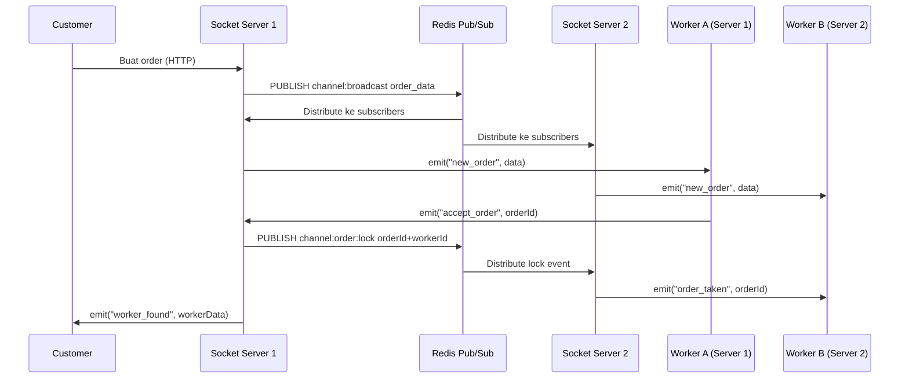

### BullMQ Workers

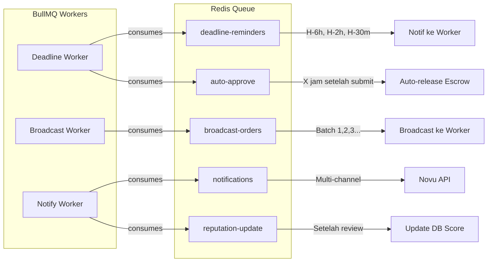

### Namespace & Rooms Socket.io

```typescript
// Namespace
/customer   → semua event untuk customer
/worker     → semua event untuk worker
/admin      → event untuk admin panel

// Rooms (per user)
`user:${userId}`         → notifikasi personal

// Rooms (per order)
`order:${orderId}`       → chat + status update per order
`broadcast:${orderId}`   → channel broadcast ke worker eligible
```

---

## 7. Database Architecture

### Connection Strategy

```typescript
// packages/db/index.ts
import { drizzle } from "drizzle-orm/neon-http";
import { neon } from "@neondatabase/serverless";
import * as schema from "./schema";

// Primary — untuk write
const primarySql = neon(process.env.DATABASE_URL!);
export const db = drizzle(primarySql, { schema });

// Read Replica — untuk query berat
const readonlySql = neon(process.env.DATABASE_URL_READONLY!);
export const dbRead = drizzle(readonlySql, { schema });
```

### Query Strategy

| Operasi                | Database     | Alasan                                  |
| ---------------------- | ------------ | --------------------------------------- |
| INSERT, UPDATE, DELETE | Primary      | ACID transaction                        |
| SELECT order detail    | Primary      | Baca setelah write (strong consistency) |
| SELECT explore workers | Read Replica | Query berat, eventual consistency ok    |
| SELECT blog posts      | Read Replica | Static content                          |
| Cache check            | Redis        | Microsecond latency                     |

### Index Strategy

Semua tabel punya index pada:

- Primary key (uuid, default)
- Foreign keys yang sering di-JOIN
- Kolom yang sering di-filter (`status`, `is_online`, `created_at`)
- Kolom unique (`email`, `order_number`, `slug`)
- Composite index untuk query umum (`category_id + status`)

### Connection Pooling

```
Neon Serverless → built-in connection pooling via Neon HTTP
Max connections : 100 (Neon default)
Timeout         : 30 detik
Idle timeout    : 10 detik
```

---

## 8. AI Architecture

### Task Analysis Flow

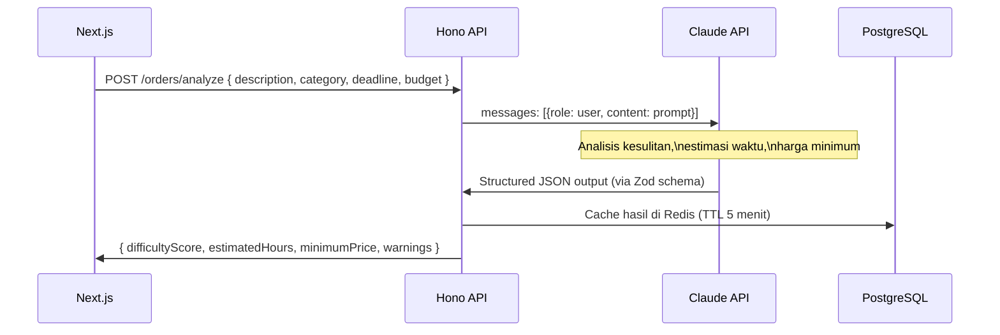

### AI Prompt Architecture

```typescript
// packages/ai/prompts/taskAnalysis.ts
export const taskAnalysisPrompt = (input: TaskAnalysisInput) => `
Kamu adalah sistem analisis tugas akademik dan profesional.
Analisis tugas berikut dan berikan output dalam format JSON.

TUGAS:
- Kategori: ${input.category}
- Deskripsi: ${input.description}
- Jumlah halaman/soal: ${input.pageCount ?? "tidak disebutkan"}
- Deadline: ${input.deadline} (${input.hoursUntilDeadline} jam dari sekarang)

OUTPUT (JSON):
{
  "difficultyScore": <1-5>,
  "difficultyReason": "<alasan singkat>",
  "estimatedHours": <angka>,
  "minimumPrice": <angka dalam Rupiah>,
  "suggestedPrice": <angka dalam Rupiah>,
  "maxRevisions": <1-4>,
  "warnings": ["<warning jika ada>"]
}

Harga minimum berdasarkan: kesulitan × estimasi jam × Rp 25.000/jam.
`;
```

### Scope Guard

```typescript
// packages/ai/prompts/scopeGuard.ts
export const scopeGuardPrompt = (message: string, originalDesc: string) => `
Bandingkan pesan chat ini dengan deskripsi order asli.
Apakah pesan mengandung permintaan BARU yang tidak ada di deskripsi asli?

DESKRIPSI ASLI: ${originalDesc}
PESAN BARU: ${message}

OUTPUT: { "isNewScope": boolean, "reason": string }
`;
```

---

## 9. Payment Architecture

### Midtrans Escrow Flow

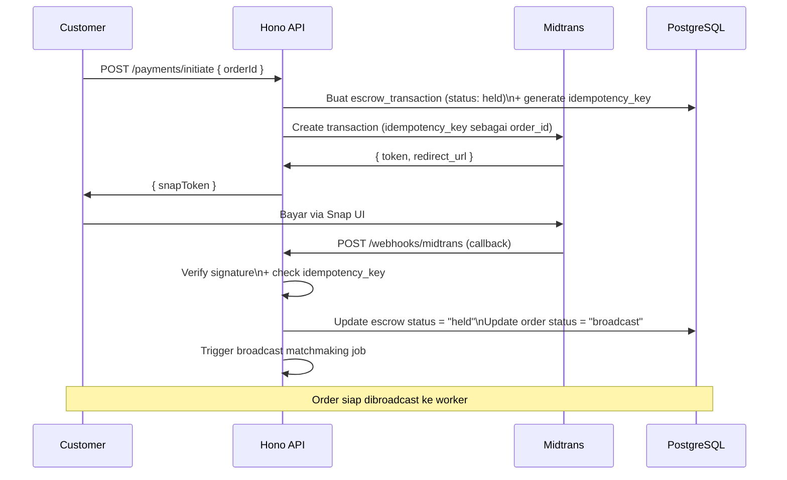

### Idempotency Protection

```typescript
// Cegah double-charge jika webhook diterima 2x
const existing = await db.query.escrowTransactions.findFirst({
  where: eq(escrowTransactions.idempotency_key, webhookData.order_id),
});

if (existing && existing.status !== "held") {
  // Sudah diproses sebelumnya — return 200 tanpa proses ulang
  return c.json(ok({ message: "Already processed" }), 200);
}

// Proses webhook dengan database transaction
await db.transaction(async (tx) => {
  await tx
    .update(escrowTransactions)
    .set({
      status: "held",
      paid_at: new Date(),
      payment_method: webhookData.payment_type,
    })
    .where(eq(escrowTransactions.idempotency_key, webhookData.order_id));

  await tx
    .update(orders)
    .set({ status: "broadcast" })
    .where(eq(orders.id, orderId));
});
```

---

## 10. CMS Architecture

### Content Flow

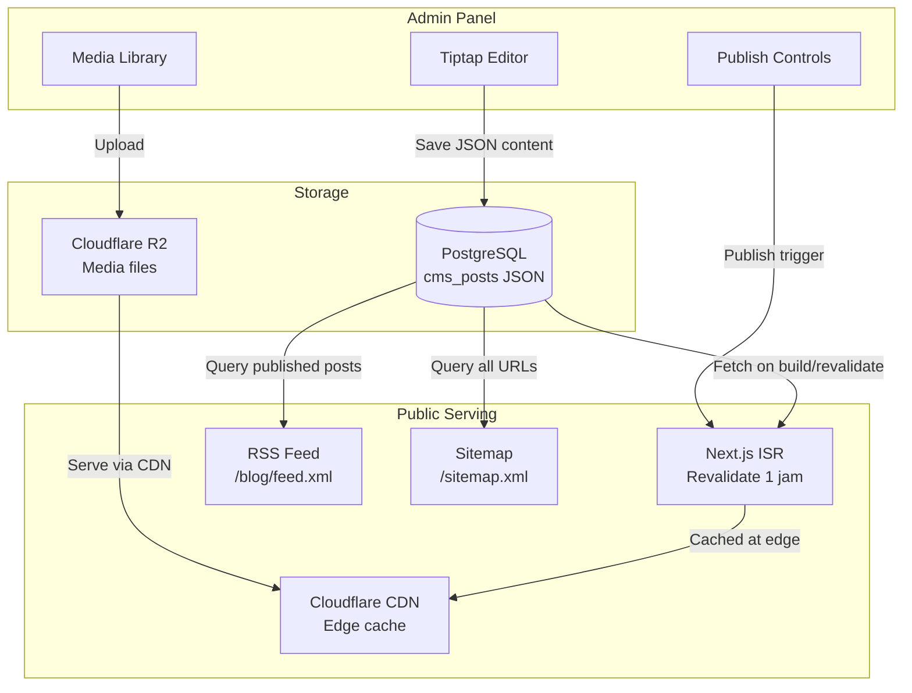

### ISR Strategy

```typescript
// app/(public)/blog/[slug]/page.tsx
export const revalidate = 3600; // 1 jam

export async function generateStaticParams() {
  const posts = await db.query.cmsPosts.findMany({
    where: eq(cmsPosts.status, "published"),
    columns: { slug: true },
  });
  return posts.map((p) => ({ slug: p.slug }));
}

export default async function BlogPost({ params }: { params: { slug: string } }) {
  const post = await db.query.cmsPosts.findFirst({
    where: and(eq(cmsPosts.slug, params.slug), eq(cmsPosts.status, "published")),
    with: { author: true, tags: true },
  });

  if (!post) notFound();
  return <BlogPostLayout post={post} />;
}
```

---

## 11. Infrastructure & DevOps

### Deployment Architecture

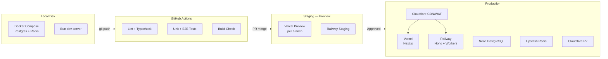

### `docker-compose.yml` — Local Dev

```yaml
version: "3.9"

services:
  postgres:
    image: pgvector/pgvector:pg17
    container_name: jokiin_postgres
    environment:
      POSTGRES_DB: jokiin_dev
      POSTGRES_USER: jokiin
      POSTGRES_PASSWORD: secret
    ports:
      - "5432:5432"
    volumes:
      - pgdata:/var/lib/postgresql/data
    healthcheck:
      test: ["CMD-SHELL", "pg_isready -U jokiin"]
      interval: 5s
      timeout: 5s
      retries: 5

  redis:
    image: redis:8-alpine
    container_name: jokiin_redis
    command: redis-server --maxmemory 256mb --maxmemory-policy allkeys-lru
    ports:
      - "6379:6379"
    volumes:
      - redisdata:/data
    healthcheck:
      test: ["CMD", "redis-cli", "ping"]
      interval: 5s

  redis-insight:
    image: redis/redisinsight:latest
    container_name: jokiin_redis_insight
    ports:
      - "5540:5540"
    depends_on:
      - redis

volumes:
  pgdata:
  redisdata:
```

### GitHub Actions — CI Pipeline

```yaml
# .github/workflows/ci.yml
name: CI

on:
  pull_request:
    branches: [main, develop]

jobs:
  check:
    runs-on: ubuntu-latest
    steps:
      - uses: actions/checkout@v4
      - uses: oven-sh/setup-bun@v2
        with:
          bun-version: "1.3.14"

      - name: Install dependencies
        run: bun install --frozen-lockfile

      - name: Lint
        run: bun run lint

      - name: Type check
        run: bun run typecheck

      - name: Unit tests
        run: bun run test:unit

      - name: Build
        run: bun run build
        env:
          DATABASE_URL: ${{ secrets.DATABASE_URL_CI }}

  e2e:
    runs-on: ubuntu-latest
    needs: check
    steps:
      - uses: actions/checkout@v4
      - uses: oven-sh/setup-bun@v2
      - run: bun install --frozen-lockfile
      - name: Install Playwright
        run: bunx playwright install --with-deps chromium
      - name: Run E2E
        run: bun run test:e2e
        env:
          BASE_URL: ${{ secrets.STAGING_URL }}
```

### GitHub Actions — Deploy Pipeline

```yaml
# .github/workflows/deploy.yml
name: Deploy

on:
  push:
    branches: [main]

jobs:
  deploy:
    runs-on: ubuntu-latest
    steps:
      - uses: actions/checkout@v4
      - uses: oven-sh/setup-bun@v2

      - name: Install & build
        run: |
          bun install --frozen-lockfile
          bun run build

      - name: Run migrations
        run: bun run db:migrate
        env:
          DATABASE_URL: ${{ secrets.DATABASE_URL_PROD }}

      - name: Deploy to Vercel (web)
        uses: amondnet/vercel-action@v25
        with:
          vercel-token: ${{ secrets.VERCEL_TOKEN }}
          vercel-org-id: ${{ secrets.VERCEL_ORG_ID }}
          vercel-project-id: ${{ secrets.VERCEL_PROJECT_ID_WEB }}
          vercel-args: "--prod"

      - name: Deploy to Railway (api + workers)
        uses: bervProject/railway-deploy@main
        with:
          railway-token: ${{ secrets.RAILWAY_TOKEN }}
          service: jokiin-api
```

---

## 12. Security Architecture

### Defense in Depth

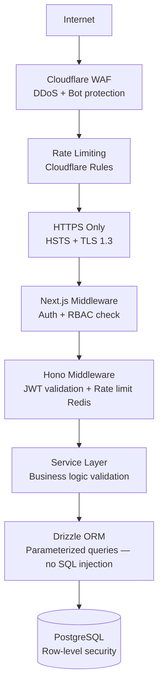

### Auth Flow — Better Auth

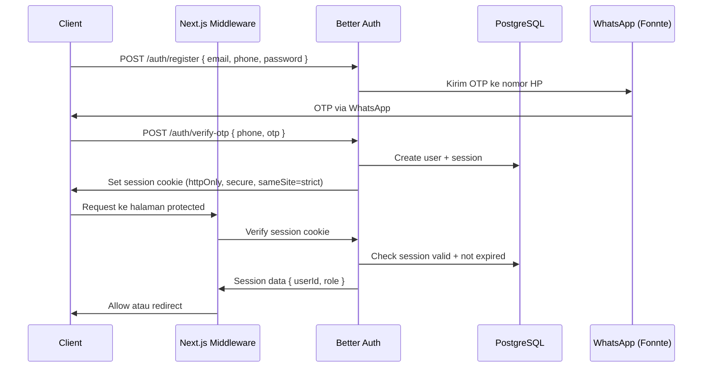

### Rate Limiting Strategy

```typescript
// middleware/rateLimit.ts — Redis sliding window
const rateLimits: Record<string, { max: number; window: number }> = {
  "POST /auth/login": { max: 10, window: 60 }, // 10 req/menit per IP
  "POST /auth/otp/verify": { max: 5, window: 60 }, // 5 req/menit per HP
  "POST /orders": { max: 20, window: 60 }, // 20 req/menit per user
  "POST /orders/:id/accept": { max: 30, window: 60 }, // 30 req/menit per worker
  "POST /payments/webhooks": { max: 200, window: 60 }, // Midtrans IPs only
  "GET /explore": { max: 60, window: 60 }, // 60 req/menit per IP
  "POST /wallet/withdraw": { max: 5, window: 300 }, // 5 req/5 menit per user
};
```

---

## 13. Monitoring & Observability

### Observability Stack

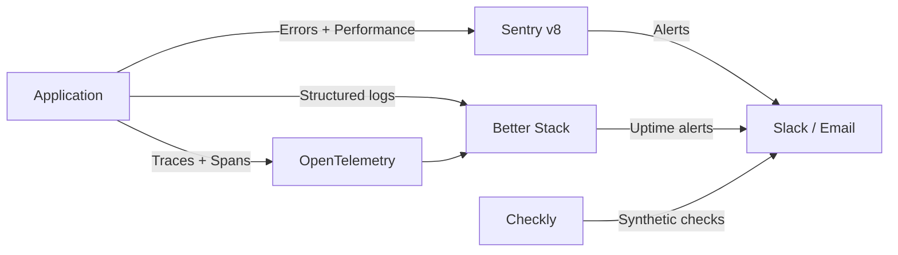

### Alert Thresholds

| Metric                  | Warning    | Critical   | Action         |
| ----------------------- | ---------- | ---------- | -------------- |
| Error rate              | > 1%       | > 5%       | Slack alert    |
| API latency p95         | > 500ms    | > 1000ms   | Slack alert    |
| DB connection pool      | > 70%      | > 90%      | Page on-call   |
| Redis memory            | > 70%      | > 85%      | Scale up       |
| Order broadcast timeout | > 10 menit | > 20 menit | Page on-call   |
| Escrow anomaly          | Any        | Any        | Immediate page |

---

## 14. Scaling Strategy

### Horizontal Scaling — Socket.io

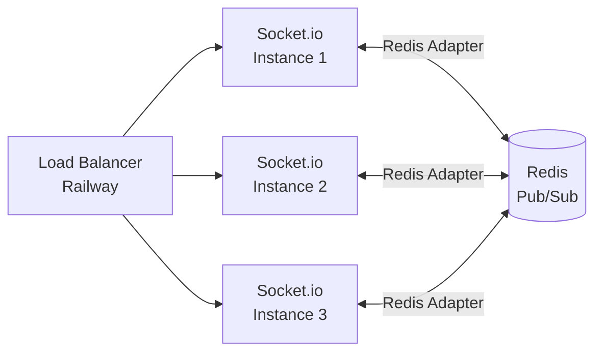

### Database Scaling

```
Phase 1 (0–10K order/bulan):
  → Neon Serverless, 1 primary, auto-scale

Phase 2 (10K–100K order/bulan):
  → Neon Read Replica untuk query explore + blog
  → Redis cache untuk hot data (profil worker, kategori)

Phase 3 (100K+ order/bulan):
  → Dedicated Neon Pro plan
  → Multiple read replicas per region
  → Partitioning tabel orders by month
  → Archiving orders completed > 1 tahun ke cold storage
```

### CDN & Caching Strategy

| Konten                 | Cache Layer          | TTL       |
| ---------------------- | -------------------- | --------- |
| Static assets (JS/CSS) | Cloudflare + Vercel  | Immutable |
| Blog post              | Cloudflare + ISR     | 1 jam     |
| Category landing       | Cloudflare + ISR     | 1 jam     |
| Worker profile publik  | Redis                | 5 menit   |
| Daftar kategori        | Redis                | 24 jam    |
| Explore workers        | Redis                | 1 menit   |
| Order detail           | No cache (sensitive) | —         |

---

_Dokumen ini adalah living document. Update setiap ada perubahan arsitektur signifikan._

**Versi:** 1.0.0 | **Tanggal:** 21 Mei 2026
