# Product Requirements Document (PRD)

## JokiIn — Platform Joki Tugas Indonesia

|            |                              |
| ---------- | ---------------------------- |
| **Versi**  | 1.0.0                        |
| **Status** | Draft                        |
| **Dibuat** | 21 Mei 2026                  |
| **Tim**    | Product, Engineering, Design |

---

## Daftar Isi

1. [Ringkasan Eksekutif](#1-ringkasan-eksekutif)
2. [Latar Belakang & Problem Statement](#2-latar-belakang--problem-statement)
3. [Target Pengguna](#3-target-pengguna)
4. [Tujuan & Metrik Keberhasilan](#4-tujuan--metrik-keberhasilan)
5. [Alur Sistem Utama](#5-alur-sistem-utama)
6. [Fitur Customer](#6-fitur-customer)
7. [Fitur Worker](#7-fitur-worker)
8. [Sistem Matchmaking](#8-sistem-matchmaking)
9. [Sistem Pembayaran & Escrow](#9-sistem-pembayaran--escrow)
10. [Sistem Chat & Komunikasi](#10-sistem-chat--komunikasi)
11. [Sistem Reputasi & Badge](#11-sistem-reputasi--badge)
12. [Sistem Revisi & Amendment](#12-sistem-revisi--amendment)
13. [Sistem Dispute](#13-sistem-dispute)
14. [Sistem Withdraw & Wallet](#14-sistem-withdraw--wallet)
15. [Admin Panel](#15-admin-panel)
16. [Trust & Keamanan](#16-trust--keamanan)
17. [AI & Intelligence](#17-ai--intelligence)
18. [Notifikasi](#18-notifikasi)
19. [Legal & Compliance](#19-legal--compliance)
20. [Non-Functional Requirements](#20-non-functional-requirements)
21. [Tech Stack](#21-tech-stack)
22. [Arsitektur Sistem](#22-arsitektur-sistem)

---

## 1. Ringkasan Eksekutif

JokiIn adalah platform marketplace dua sisi (two-sided marketplace) yang menghubungkan **customer** (siswa, mahasiswa, dan kalangan umum yang membutuhkan bantuan pengerjaan tugas) dengan **worker** (tenaga ahli terverifikasi yang menyediakan jasa pengerjaan).

Platform menggunakan model matchmaking real-time bergaya Gojek — customer membuat order, sistem broadcast ke worker yang paling eligible secara bersamaan, dan worker pertama yang menerima mendapat pekerjaan. Seluruh pembayaran melalui sistem escrow yang aman.

---

## 2. Latar Belakang & Problem Statement

### Masalah yang Ada Saat Ini

| Pihak         | Masalah                                                                            |
| ------------- | ---------------------------------------------------------------------------------- |
| Customer      | Tidak tahu apakah worker bisa dipercaya                                            |
| Customer      | Takut bayar dulu tapi hasilnya mengecewakan                                        |
| Customer      | Tidak ada kepastian deadline terpenuhi                                             |
| Worker        | Tidak ada platform resmi, transaksi via WA tidak terlindungi                       |
| Worker        | Sering tidak dibayar atau customer ghosting setelah terima hasil                   |
| Worker        | Tidak ada sistem yang membangun reputasi mereka secara profesional                 |
| Platform lama | Tidak ada escrow, tidak ada matchmaking cerdas, tidak ada perlindungan kedua pihak |

### Solusi JokiIn

- **Escrow**: dana customer ditahan platform hingga hasil disetujui
- **Matchmaking AI**: order masuk ke worker yang paling cocok dan tersedia
- **Trust system**: verifikasi sosial media + tes kemampuan + rating multidimensi
- **Perlindungan kedua pihak**: aturan yang adil untuk customer dan worker
- **Transparansi penuh**: semua biaya terlihat jelas sebelum transaksi

---

## 3. Target Pengguna

### Customer (Pembeli)

- Siswa SMA/SMK yang butuh bantuan PR atau tugas sekolah
- Mahasiswa D3/S1 yang butuh bantuan tugas kuliah, laporan, atau skripsi
- Karyawan yang butuh bantuan konten, dokumen, atau presentasi
- Umur: 15–35 tahun
- Lokasi: seluruh Indonesia (fokus awal: Jawa & Bali)

### Worker (Penyedia Jasa)

- Mahasiswa tingkat atas atau fresh graduate
- Profesional dengan keahlian spesifik (programmer, desainer, akuntan, dll)
- Guru/dosen yang ingin side income
- Umur: 18–45 tahun
- Motivasi utama: penghasilan tambahan yang fleksibel

### Admin

- Tim internal platform yang mengelola operasional, verifikasi, dan dispute

---

## 4. Tujuan & Metrik Keberhasilan

### Tujuan Bisnis

- Menjadi platform joki tugas terpercaya #1 di Indonesia dalam 2 tahun
- GMV Rp 1 miliar dalam 6 bulan pertama operasional

### Key Metrics

| Metrik               | Target 3 Bulan | Target 6 Bulan | Target 12 Bulan |
| -------------------- | -------------- | -------------- | --------------- |
| Registered customers | 5.000          | 20.000         | 80.000          |
| Registered worker    | 500            | 2.000          | 8.000           |
| Order per bulan      | 2.000          | 10.000         | 40.000          |
| Order success rate   | > 85%          | > 90%          | > 93%           |
| Avg match time       | < 10 menit     | < 7 menit      | < 5 menit       |
| Customer repeat rate | > 30%          | > 45%          | > 55%           |
| Revenue platform     | Rp 50jt/bln    | Rp 250jt/bln   | Rp 1M/bln       |
| Dispute rate         | < 8%           | < 5%           | < 3%            |

---

## 5. Alur Sistem Utama

### Alur Order Lengkap

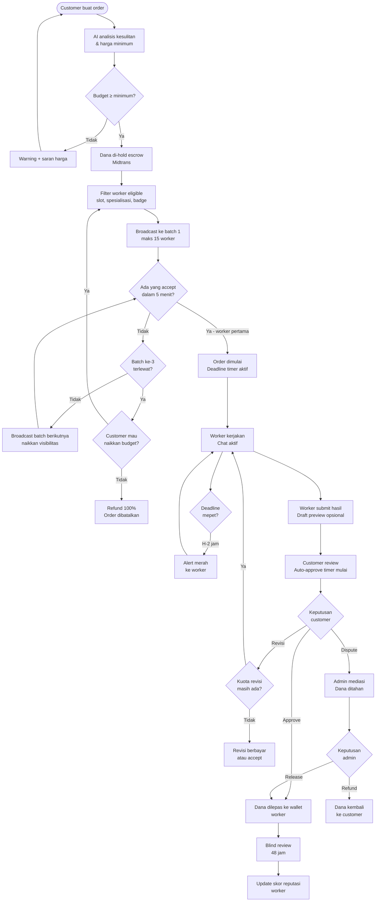

### Alur Matchmaking Detail

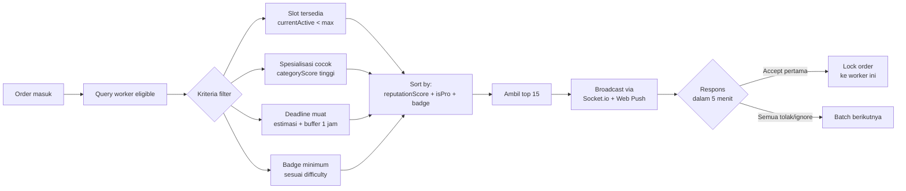

---

## 6. Fitur Customer

### 6.1 Registrasi & Login

- Daftar via email atau nomor HP
- Verifikasi OTP via WhatsApp
- Login dengan email/HP + password
- 2FA opsional (recommended untuk akun VIP)

### 6.2 Membuat Order

Form order terstruktur (bukan teks bebas):

| Field                | Keterangan                                | Wajib |
| -------------------- | ----------------------------------------- | ----- |
| Kategori             | Dropdown hierarki (Matematika > Kalkulus) | ✅    |
| Judul                | Max 300 karakter                          | ✅    |
| Deskripsi            | Min 100 karakter, panduan terstruktur     | ✅    |
| Format output        | Word / PDF / PPT / Code / Lainnya         | ✅    |
| Jumlah halaman/soal  | Angka                                     | ❌    |
| Hal yang TIDAK boleh | Batasan konten                            | ❌    |
| File referensi       | Upload max 10 file, 50MB total            | ❌    |
| Deadline             | Date + time picker                        | ✅    |
| Budget               | Angka dalam Rupiah                        | ✅    |

Setelah submit → AI analisis otomatis dan tampilkan skor kesulitan + harga minimum yang disarankan.

### 6.3 Dashboard Customer

```
Tab: Aktif | Riwayat | Favorit | Voucher
```

**Tab Aktif:**

- Kartu order dengan countdown deadline real-time
- Status broadcast (menunggu worker / worker ditemukan / sedang dikerjakan)
- Tombol chat langsung
- Progress bar visual

**Tab Riwayat:**

- Filter: status, kategori, tanggal, worker
- Export riwayat ke PDF
- Reorder dengan 1 klik (buat order baru dengan deskripsi yang sama)

**Tab Favorit:**

- List worker favorit + status online real-time
- Tombol "Pesan Langsung" (bypass broadcast, langsung hire)
- Waiting list jika worker sedang penuh

### 6.4 Halaman Explore Worker

Filter:

- Kategori & subkategori
- Badge (SPROUT–APEX)
- Rating minimum (slider)
- Status tersedia sekarang
- Waktu respons rata-rata

Sort: Paling relevan (AI) / Rating tertinggi / Order terbanyak / Harga terrendah

Card worker menampilkan: nama/username, badge, rating, spesialisasi, respons rata-rata, harga mulai dari.

### 6.5 Profil Worker (Publik)

- Info dasar (nama/alias, badge, verified ✓)
- Rating breakdown: Kualitas, Komunikasi, Ketepatan Waktu
- Skor per kategori dengan jumlah order
- Social media terverifikasi (icon saja, tidak tampil link)
- Portofolio publik
- Ulasan customer terbaru (setelah blind review revealed)
- Tombol: Pesan Langsung, Favorit, Waiting List

### 6.6 Level Customer

| Level   | Syarat                         | Benefit                                   |
| ------- | ------------------------------ | ----------------------------------------- |
| Pemula  | Order pertama                  | Garansi uang kembali 100% jika tidak puas |
| Reguler | 5+ order selesai               | Akses worker verified lebih cepat         |
| Setia   | 20+ order, rating worker ≥ 4.5 | Diskon komisi 5%                          |
| VIP     | 50+ order                      | Direct ke worker Elite, layanan prioritas |

---

## 7. Fitur Worker

### 7.1 Registrasi & Verifikasi

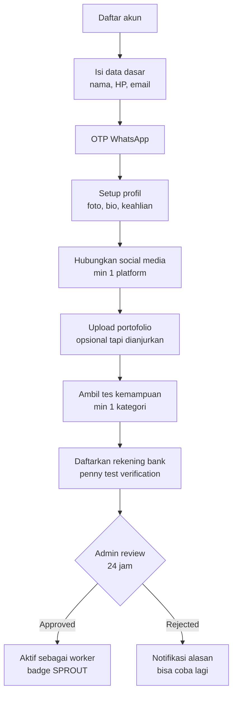

**Trust Score Awal:**

| Sumber                                          | Poin |
| ----------------------------------------------- | ---- |
| LinkedIn terverifikasi (> 10 koneksi)           | +25  |
| GitHub aktif (> 5 repo publik)                  | +20  |
| Behance/Dribbble terverifikasi                  | +20  |
| Instagram/TikTok (> 50 followers, akun > 6 bln) | +10  |
| YouTube (konten edukatif)                       | +15  |
| Tes kemampuan > 70                              | +20  |
| Portofolio diverifikasi admin                   | +20  |

Score 0–30 → SPROUT | 31–50 → SPARK langsung | 51+ → BLAZE langsung

### 7.2 Dashboard Worker

**Metric Cards:**

- Saldo tersedia & pending
- Order aktif saat ini
- Total penghasilan bulan ini
- Rata-rata rating (bintang)
- Completion rate
- Posisi dalam antrian broadcast (badge semakin tinggi = lebih depan)

**Grafik:**

- Penghasilan per hari (30 hari)
- Jam tersibuk order masuk (heatmap)
- Perbandingan bulan ini vs bulan lalu

**Manajemen Slot:**

- Toggle online/offline
- Set jadwal aktif (jam + hari)
- Set mode libur (off untuk periode tertentu)
- Set max order aktif (1–5)

### 7.3 Menerima Order

Notifikasi order masuk berisi:

- Kategori & judul (deskripsi tersembunyi sampai accept)
- Skor kesulitan (1–5)
- Budget yang ditawarkan & estimasi worker terima
- Deadline customer & estimasi worker harus selesai (deadline - 1 jam)
- Badge minimum yang dibutuhkan

Tombol: **Accept** (kunci order) | **Tolak** (tanpa penalti, tapi response rate turun)

Timer countdown di notifikasi: 5 menit untuk respond.

### 7.4 Mengerjakan Order

- Akses deskripsi lengkap + file lampiran customer
- Chat dengan customer
- Update progress (opsional: kirim milestone update)
- Upload draft preview (watermarked) sebelum submit final
- Submit hasil final + catatan

### 7.5 Catatan Pribadi tentang Customer

Worker bisa simpan catatan internal per customer yang tidak terlihat siapapun selain dirinya sendiri.

### 7.6 Analytics Worker

- Breakdown skor reputasi per komponen
- Performa per kategori
- Estimasi pendapatan jika naik badge
- Jam-jam paling profitable
- Kategori yang paling sering di-order

---

## 8. Sistem Matchmaking

### Kriteria Eligibility Worker

Worker dimasukkan antrian broadcast HANYA jika memenuhi semua:

1. `isOnline = true` dan bukan jam libur
2. `currentActiveOrders < maxActiveOrders`
3. Punya skor di kategori yang dipesan (pernah kerjakan atau lulus tes)
4. Badge level cukup untuk difficulty order:
   - Difficulty 1–2 → semua badge
   - Difficulty 3 → SPARK ke atas
   - Difficulty 4 → BLAZE ke atas
   - Difficulty 5 → PRIME ke atas (APEX eksklusif mendapat notif lebih awal)
5. Estimasi waktu pengerjaan + buffer 1 jam ≤ sisa waktu ke deadline customer
6. Tidak sedang dalam masa suspend/banned

### Algoritma Sorting

Worker yang masuk eligibility diurutkan berdasarkan:

```
Score = (reputationScore × 0.5) + (categoryScore × 0.3) + (badgeBonus × 0.2)

badgeBonus:
  SPROUT = 0 | SPARK = 10 | BLAZE = 20 | PRIME = 30 | APEX = 40
  isPro = +5 bonus tambahan
```

### Mekanisme Broadcast

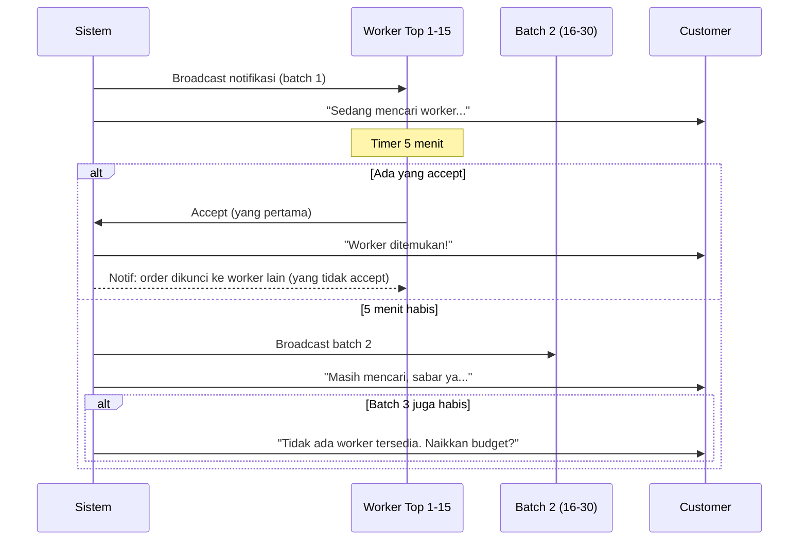

### Emergency Order

Order dengan deadline < 3 jam dari sekarang:

- Badge otomatis "URGENT 🔴" di notifikasi worker
- Broadcast ke semua worker eligible sekaligus (tidak ada batching)
- Surge pricing otomatis: harga minimum × 1.5
- Worker yang complete emergency order tepat waktu: +3 poin reputasi bonus

---

## 9. Sistem Pembayaran & Escrow

### Alur Pembayaran

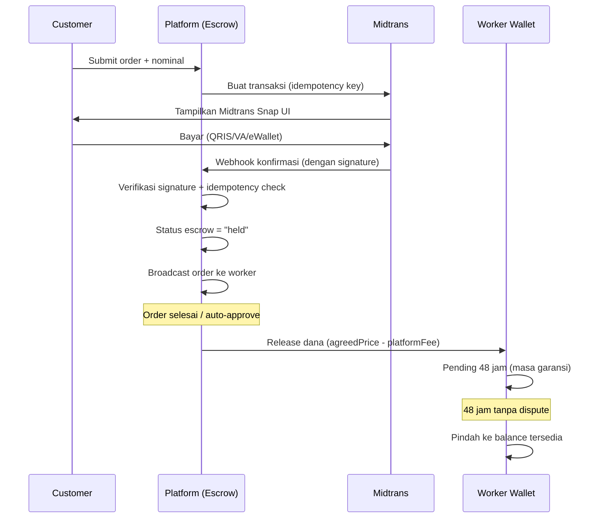

### Kalkulasi Biaya

```
Customer bayar: agreedPrice (budget yang disepakati)
Platform fee  : agreedPrice × 12% (default, bisa beda per badge)
Worker terima: agreedPrice - platformFee

Contoh:
  Budget       : Rp 200.000
  Platform fee : Rp 24.000 (12%)
  Worker terima: Rp 176.000
```

Komisi per badge:
| Badge | Komisi Platform |
|---|---|
| SPROUT | 15% |
| SPARK | 13% |
| BLAZE | 12% |
| PRIME | 10% |
| APEX | 8% |

### Escrow Parsial (Milestone) untuk Tugas > 3 Hari

| Milestone       | Trigger Release                | % Dana |
| --------------- | ------------------------------ | ------ |
| Milestone 1     | Customer approve draft/outline | 30%    |
| Milestone Final | Customer approve hasil final   | 70%    |

### Kebijakan Refund

| Situasi                                       | Refund Customer               | Kompensasi Worker      |
| --------------------------------------------- | ----------------------------- | ---------------------- |
| Tidak ada worker accept                       | 100%                          | —                      |
| Customer cancel sebelum worker accept         | 100%                          | —                      |
| Customer cancel setelah accept, sebelum mulai | 90%                           | 10% (kompensasi waktu) |
| Customer cancel setelah worker mulai          | Tidak bisa, harus dispute     | —                      |
| Worker cancel sebelum mulai                   | 100%                          | Penalti -5 poin        |
| Worker cancel di tengah jalan                 | Proporsional (sisa pekerjaan) | Penalti berat          |
| Worker tidak selesai (deadline lewat)         | 100%                          | Penalti -25 poin       |

---

## 10. Sistem Chat & Komunikasi

### Aturan Chat

- Chat baru bisa dimulai SETELAH order resmi (worker sudah accept)
- Semua pesan tersimpan permanen sebagai bukti
- Chat dikunci (read-only) setelah order selesai + 7 hari
- Admin bisa baca semua chat untuk keperluan dispute

### Moderasi Otomatis

Setiap pesan diproses filter sebelum terkirim:

| Pola                           | Aksi                          |
| ------------------------------ | ----------------------------- |
| Nomor HP (08xx, +62xx)         | Blokir + flag + warning       |
| Email (@gmail, @yahoo, dll)    | Blokir + flag                 |
| Link WA (wa.me, chat.whatsapp) | Blokir + flag                 |
| Nomor rekening (10–16 digit)   | Blokir + flag + alert finance |
| Link eksternal lain            | Warning, perlu konfirmasi     |
| Kata kasar/harassment          | Flag untuk moderator review   |

### Fitur Chat

- Teks + emoji
- Upload file (max 20MB per file, tipe: gambar, PDF, dokumen)
- File yang dikirim worker ke customer otomatis di-watermark dengan ID order
- Indikator "sedang mengetik"
- Tanda baca (terkirim ✓, terbaca ✓✓)
- Notifikasi respons lambat (jika > 2 jam tidak balas saat order aktif)

### Response Rate & Fast Responder

- Sistem hitung rata-rata waktu respons dalam 30 hari terakhir
- Tampil di profil: "Biasanya balas dalam X menit"
- Badge **Fast Responder** jika rata-rata < 15 menit
- Response rate < 50% → frekuensi broadcast dikurangi sistem

---

## 11. Sistem Reputasi & Badge

### Formula Skor Reputasi

```
Skor Total (0–100) =
  (ratingCustomer    × 35%) +
  (completionRate    × 25%) +
  (deadlineScore     × 20%) +
  (responseRate      × 10%) +
  (repeatCustomerRate× 10%)
```

**Penjelasan komponen:**

| Komponen             | Cara Hitung                                             | Bobot |
| -------------------- | ------------------------------------------------------- | ----- |
| Rating customer      | Rata-rata overall rating dari semua review              | 35%   |
| Completion rate      | % order selesai dari total yang diaccept                | 25%   |
| Deadline score       | % order selesai sebelum deadline                        | 20%   |
| Response rate        | % broadcast yang direspons (accept/tolak) dalam 5 menit | 10%   |
| Repeat customer rate | % customer yang order ke worker yang sama > 1x          | 10%   |

### Sistem Badge

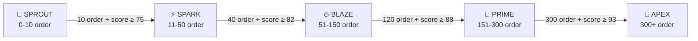

**Efek badge:**

- Posisi lebih depan dalam antrian broadcast
- PRIME & APEX: bisa tolak order dari customer dengan skor rendah tanpa penalti
- APEX: notifikasi eksklusif untuk order difficulty 5

**Turun badge:**

- Jika skor jatuh di bawah threshold selama 30 hari berturut-turut
- Notifikasi peringatan 7 hari sebelum turun
- Tidak bisa turun lebih dari 1 level per periode

### Blind Review System

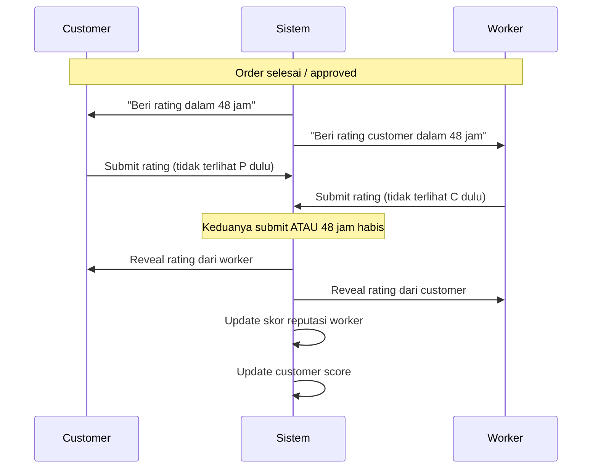

### Sistem Penalti

| Pelanggaran                         | Penalti Poin | Strike | Catatan                      |
| ----------------------------------- | ------------ | ------ | ---------------------------- |
| Cancel setelah accept (belum mulai) | -5           | +1     | —                            |
| Cancel di tengah pengerjaan         | -15          | +2     | Refund proporsional          |
| Terlambat < 30 menit                | -3           | 0      | —                            |
| Terlambat > 30 menit                | -10          | 0      | Refund parsial otomatis      |
| Tidak submit sama sekali            | -25          | +2     | Full refund customer         |
| Terbukti plagiat                    | -30          | +3     | Full refund customer         |
| Coba kirim kontak eksternal di chat | -10          | +1     | —                            |
| 3 strike dalam 30 hari              | —            | —      | Suspend 7 hari               |
| 5 strike total                      | —            | —      | Review admin, potensi banned |

---

## 12. Sistem Revisi & Amendment

### Kalkulasi Revisi Gratis

Revisi gratis ditentukan otomatis berdasarkan kombinasi kesulitan × waktu pengerjaan:

| Kesulitan   | < 6 jam | 6–24 jam | > 24 jam |
| ----------- | ------- | -------- | -------- |
| Mudah (1–2) | 1x      | 2x       | 3x       |
| Sedang (3)  | 1x      | 2x       | 3x       |
| Sulit (4–5) | 2x      | 3x       | 4x       |

Jika budget sangat tinggi (> 3× harga minimum): +1 revisi bonus otomatis.

**Aturan revisi:**

- Revisi hanya untuk hal yang ada dalam deskripsi awal yang terkunci
- Scope baru = Amendment, bukan revisi gratis
- Revisi berbayar setelah kuota habis: 25% dari harga order awal
- Customer punya waktu 2× waktu pengerjaan untuk minta revisi setelah submit

### Sistem Amendment

Untuk perubahan scope, deadline, atau harga setelah order berjalan:

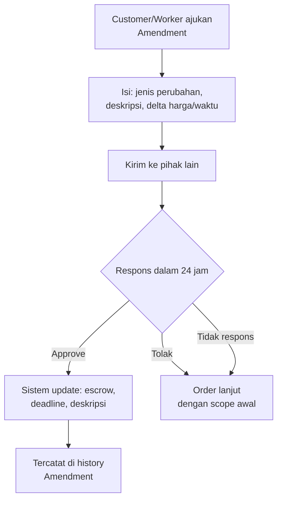

**Catatan:** Semua perubahan HARUS lewat Amendment — tidak bisa via chat saja. Chat tidak punya kekuatan hukum dalam dispute.

---

## 13. Sistem Dispute

### Alasan Valid Dispute

**Customer bisa dispute jika:**

- Hasil tidak sesuai deskripsi awal yang terkunci
- File hasil tidak bisa dibuka atau rusak
- Terbukti plagiat (wajib sertakan bukti)
- Worker tidak merespons dalam 24 jam saat order aktif

**Worker bisa dispute jika:**

- Customer minta di luar scope tanpa Amendment
- Customer tidak memberikan informasi yang dijanjikan
- Customer tidak approve meski hasil sudah sesuai deskripsi

### Alur Penanganan Dispute

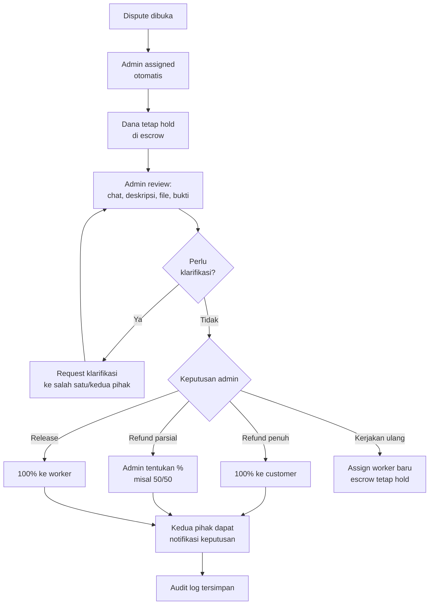

**SLA penanganan dispute:** 24 jam (target). Lebih dari 48 jam → eskalasi otomatis ke admin senior.

---

## 14. Sistem Withdraw & Wallet

### Struktur Wallet

```
Wallet Worker
├── balance          → bisa ditarik sekarang
└── pending_balance  → dalam masa garansi 48 jam setelah order selesai
```

Setelah 48 jam tanpa dispute → `pending_balance` otomatis masuk `balance`.

### Ketentuan Withdraw

| Aturan              | Nilai                                   |
| ------------------- | --------------------------------------- |
| Minimum withdraw    | Rp 50.000                               |
| Maksimum per hari   | Rp 10.000.000 (PRIME/APEX lebih tinggi) |
| Jadwal proses       | Setiap hari kerja 09.00 & 14.00 WIB     |
| Dana masuk rekening | T+1 hari kerja                          |
| Frekuensi maksimum  | 3x per hari                             |

| Nominal                | Biaya Admin |
| ---------------------- | ----------- |
| < Rp 100.000           | Rp 2.500    |
| Rp 100.000 – 1.000.000 | Rp 5.000    |
| > Rp 1.000.000         | Gratis      |

### Verifikasi Rekening Bank

1. Input nama bank, nomor rekening, nama pemilik
2. Sistem kirim **penny test** (Rp 1) ke rekening
3. Worker konfirmasi 3 digit kode unik di keterangan transfer
4. Jika cocok → rekening terverifikasi
5. Ganti rekening: cooldown 7 hari + verifikasi ulang

### Keamanan Withdraw

- OTP WhatsApp wajib setiap request
- Login device baru → withdraw dikunci 24 jam
- Withdraw > 3× rata-rata bulanan → flag untuk review
- Gagal OTP 3× → kunci 30 menit + notifikasi email

---

## 15. Admin Panel

### Role Hierarchy

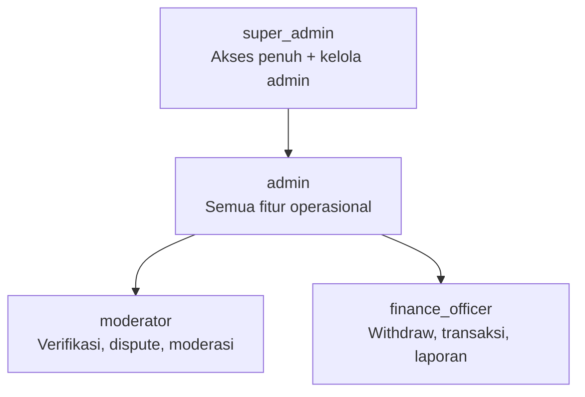

### Modul Admin

| Modul               | Akses            | Fungsi Utama                                     |
| ------------------- | ---------------- | ------------------------------------------------ |
| Dashboard           | Semua            | GMV, order aktif, alert real-time                |
| Manajemen Order     | admin+           | Monitor, force-complete, cancel, extend          |
| Verifikasi Worker   | moderator+       | Review social media, portofolio, approve/reject  |
| Dispute             | moderator+       | Assigned queue, review bukti, keputusan resolusi |
| Manajemen User      | moderator+       | Lihat detail, suspend, ban, peringatan           |
| Keuangan            | finance_officer+ | Withdraw queue, rekonsiliasi, laporan            |
| Moderasi Chat       | moderator+       | Flagged messages, hapus pesan, lock chat         |
| Pengaturan Platform | super_admin      | Komisi, batas, template notif, voucher           |

### Aturan Keamanan Admin

- Admin panel di subdomain terpisah: `admin.jokiin.id`
- Akses hanya dari IP whitelist
- 2FA wajib semua level
- Session timeout 30 menit idle
- Semua aksi kritis dicatat di `audit_logs` — tidak bisa dihapus
- Ban oleh `admin` perlu approval `super_admin` dalam 24 jam

---

## 16. Trust & Keamanan

### Verifikasi Social Media Worker

**Metode verifikasi tanpa dokumen fisik:**

1. Worker paste URL profil
2. Worker tambahkan kode unik (contoh: `#JKT-A3F9`) di bio sementara
3. Admin atau sistem verifikasi kode tersebut ada di profil
4. Setelah verified, kode boleh dihapus

**Kriteria akun valid:**

- Umur akun > 6 bulan
- Post/aktivitas terakhir dalam 90 hari
- Foto profil ada (bukan default)
- GitHub: bisa dicek via public API otomatis

### Anti-Fraud

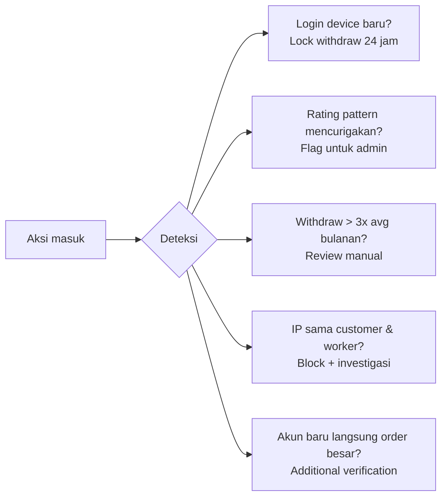

### Keamanan Data (UU PDP Indonesia)

- Consent eksplisit saat registrasi
- Hak akses, koreksi, hapus, portabilitas data
- Soft delete: data pribadi di-anonymize dalam 30 hari setelah request hapus
- Data transaksi tetap ada 5 tahun untuk kebutuhan hukum
- Log audit disimpan 5 tahun

### Rate Limiting

| Endpoint               | Limit                            |
| ---------------------- | -------------------------------- |
| POST /auth/login       | 10 req/menit per IP              |
| POST /auth/otp/verify  | 5 req/menit per HP               |
| POST /orders           | 20 req/menit per user            |
| GET /explore           | 60 req/menit per IP              |
| POST /payments/webhook | 200 req/menit (IP Midtrans only) |

---

## 17. AI & Intelligence

### Provider AI

Platform menggunakan **free tier AI providers** via Vercel AI SDK v4 — tidak bergantung pada satu provider. Provider dapat diganti tanpa mengubah kode bisnis.

| Provider  | Model                   | Free Tier Limit   | Digunakan untuk           |
| --------- | ----------------------- | ----------------- | ------------------------- |
| Groq      | llama-3.3-70b-versatile | 14.400 req/hari   | Task analysis (primary)   |
| Mistral   | mistral-small-latest    | ~1 req/detik      | Fallback + structured out |
| Cerebras  | llama3.1-70b            | Free tier         | Scope guard (butuh cepat) |
| Google    | gemini-1.5-flash        | 1.500 req/hari    | Fallback terakhir         |

### Analisis Kesulitan Tugas

Saat customer submit deskripsi order, sistem memanggil AI (Groq/Mistral) untuk menganalisis:

**Input ke AI:**

- Kategori & subkategori
- Deskripsi lengkap
- Jumlah halaman/soal
- Deadline yang diminta
- File lampiran (jika ada, kirim summary)

**Output AI (JSON terstruktur via Zod + `generateObject`):**

```json
{
  "difficultyScore": 3,
  "difficultyReason": "Topik termodinamika tingkat universitas dengan 5 soal analisis",
  "estimatedHours": 4.5,
  "minimumPrice": 125000,
  "suggestedPrice": 175000,
  "maxRevisions": 2,
  "warnings": ["Deadline mepet untuk kompleksitas ini, disarankan tambah 2 jam"]
}
```

### Scope Guard di Chat

AI monitor setiap pesan di chat. Jika pesan customer mengandung permintaan baru di luar deskripsi awal:

> ⚠️ Pesan ini terdeteksi mengandung permintaan di luar scope order awal. Apakah kamu ingin mengajukan Amendment resmi?

Tombol: [Ajukan Amendment] [Abaikan, ini hanya diskusi]

### AI Matching (pgvector)

Profil keahlian worker disimpan sebagai vector embedding. Saat ada order masuk, sistem mencari worker dengan embedding paling mirip dengan deskripsi order — lebih akurat dari keyword matching biasa. Embedding di-generate menggunakan model embedding gratis (Mistral embed / Groq).

---

## 18. Notifikasi

### Channel & Prioritas

| Channel            | Gunakan untuk                           | Delay max  |
| ------------------ | --------------------------------------- | ---------- |
| In-app (Socket.io) | Semua notif real-time                   | Instant    |
| Web Push           | Order baru untuk worker, deadline mepet | < 5 detik  |
| WhatsApp (Fonnte)  | OTP, order penting, keputusan dispute   | < 30 detik |
| Email (Resend)     | Konfirmasi, laporan bulanan, newsletter | < 2 menit  |

### Notifikasi Deadline Berjenjang

| Waktu          | Channel                  | Pesan                             |
| -------------- | ------------------------ | --------------------------------- |
| H-24 jam       | In-app                   | Reminder ringan                   |
| H-6 jam        | In-app + Web Push        | "Deadline semakin dekat"          |
| H-2 jam        | In-app + Web Push + WA   | "⚠️ 2 jam lagi deadline!"         |
| H-30 menit     | Semua channel            | "🔴 30 menit lagi! Segera submit" |
| Lewat deadline | Sistem eskalasi otomatis | Penalti diproses                  |

---

## 19. Legal & Compliance

### Posisi Platform

JokiIn adalah **platform penghubung** (marketplace), bukan pihak yang mengerjakan atau menggunakan hasil tugas. Platform tidak bertanggung jawab atas bagaimana pengguna menggunakan hasil karya yang diperoleh.

### Disclaimer Wajib

Tampil di setiap halaman order dan ToS:

> _Platform hanya menyediakan layanan penghubung antara pengguna. Segala hasil karya adalah untuk keperluan referensi dan belajar. Pengguna bertanggung jawab penuh atas penggunaan hasil karya. Platform tidak bertanggung jawab atas pelanggaran integritas akademik._

Customer wajib centang checkbox ini sebelum submit order.
Worker wajib centang bahwa karya adalah orisinal sebelum submit hasil.

### Pajak

- Platform lapor PPN atas komisi jika omzet > Rp 4,8M/tahun
- Worker bertanggung jawab lapor PPh sendiri
- Platform sediakan laporan penghasilan tahunan untuk keperluan SPT worker

---

## 20. Non-Functional Requirements

| Aspek             | Target                                        |
| ----------------- | --------------------------------------------- |
| Uptime            | 99.9% (maksimum 8.7 jam downtime/tahun)       |
| Latency API       | < 200ms p95 untuk endpoint utama              |
| WebSocket latency | < 100ms untuk notifikasi order                |
| Concurrent users  | 10.000 simultaneous (scale ke 100.000)        |
| File upload       | Max 50MB per order, max 20MB per file di chat |
| Database          | RTO < 1 jam, RPO < 15 menit                   |
| Backup            | Daily otomatis, PITR 7 hari, weekly ke R2     |
| Security          | OWASP Top 10 compliant, CSP, HSTS             |

---

## 21. Tech Stack

| Layer              | Teknologi             | Versi             |
| ------------------ | --------------------- | ----------------- |
| Frontend Framework | Next.js               | 16.2.6 LTS        |
| Language           | TypeScript            | 5.8               |
| CSS                | Tailwind CSS          | v4.1              |
| UI Components      | shadcn/ui             | 2026              |
| State (server)     | TanStack Query        | v5                |
| State (client)     | Zustand               | v5                |
| Form & Validation  | React Hook Form + Zod | v4                |
| Backend Runtime    | Bun                   | 1.3.14            |
| Backend Framework  | Hono                  | v4                |
| ORM                | Drizzle ORM           | v1-beta           |
| Primary DB         | PostgreSQL (Neon)     | 17                |
| Cache/Session      | Redis (Upstash)       | 8                 |
| Vector Search      | pgvector              | 0.8               |
| Real-time          | Socket.io             | 4.8               |
| Job Queue          | BullMQ                | v5                |
| AI (primary)       | Groq API              | llama-3.3-70b-versatile |
| AI (fallback)      | Mistral API           | mistral-small-latest    |
| AI (alternatif)    | Cerebras API          | llama3.1-70b            |
| AI SDK             | Vercel AI SDK         | v4                |
| Payment            | Midtrans Snap         | v3                |
| Storage            | Cloudflare R2         | —                 |
| File Upload        | Uploadthing           | v7                |
| Auth               | Better Auth           | v1.2              |
| OTP                | Fonnte (WhatsApp)     | —                 |
| Email              | Resend                | v4                |
| Notification       | Novu                  | v2                |
| Frontend Deploy    | Vercel                | —                 |
| Backend Deploy     | Railway               | —                 |
| CDN/WAF            | Cloudflare            | —                 |
| Error Tracking     | Sentry                | v8                |
| Logging            | Better Stack          | —                 |
| Tracing            | OpenTelemetry         | v1.9              |
| Testing (unit)     | Bun Test              | built-in          |
| Testing (E2E)      | Playwright            | v1.50             |

---

## 22. Arsitektur Sistem

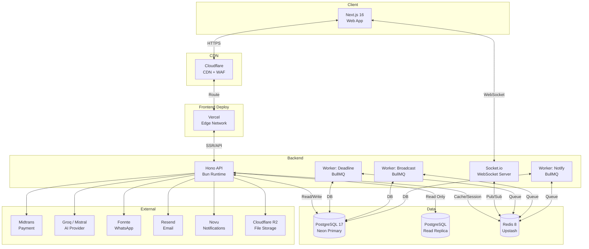

### Horizontal Scaling Socket.io

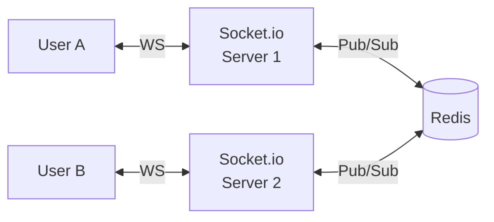

Broadcast order dari Server 1 diterima User B di Server 2 melalui Redis Pub/Sub.

---

_Dokumen ini adalah living document yang akan diperbarui seiring perkembangan produk._

**Versi:** 1.0.0 | **Tanggal:** 21 Mei 2026 | **Status:** Draft

---

## 23. CMS — Blog & Content Management System

### 23.1 Latar Belakang

Platform membutuhkan konten publik untuk mendukung strategi SEO dan growth. Semua konten dikelola melalui **Custom CMS built-in** di admin panel — tidak ada ketergantungan pada tools external (Sanity, Contentful, dsb). Konten disimpan di PostgreSQL yang sudah ada, media di Cloudflare R2.

### 23.2 Tipe Konten

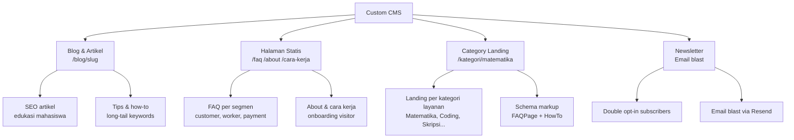

### 23.3 Arsitektur CMS

**Rich Text Editor:** Tiptap v3

- Konten disimpan sebagai JSON (Tiptap document format) di kolom `content` (jsonb)
- HTML rendered disimpan di `content_html` untuk serving cepat tanpa re-render
- Ekstensi yang dipakai: Heading, Bold, Italic, Link, Image, Table, CodeBlock, YouTube embed, Callout

**Media Library:**

- Upload langsung ke Cloudflare R2 via presigned URL
- Metadata (dimensi, ukuran, alt text) disimpan di tabel `cms_media`
- Admin bisa browse, search, dan reuse media yang sudah diupload
- Alt text wajib diisi sebelum media bisa digunakan (aksesibilitas + SEO)

**SEO Architecture:**

```
Setiap konten punya:
├── meta_title          (max 60 karakter, dengan counter real-time)
├── meta_description    (max 160 karakter, dengan counter real-time)
├── og_image            (dipilih dari media library)
├── canonical_url       (opsional, untuk konten republish)
├── schema_type         (Article | FAQPage | HowTo)
└── schema_data         (JSON-LD data, di-generate otomatis + bisa custom)
```

**Sitemap & RSS:**

- `next-sitemap` generate `/sitemap.xml` otomatis dari semua post published
- RSS feed `/blog/feed.xml` untuk blog reader
- Sitemap disubmit otomatis ke Google Search Console via API setiap ada post baru

### 23.4 Workflow Editorial

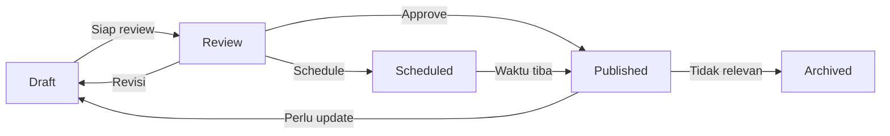

| Status    | Visible Publik    | Bisa Diedit                      |
| --------- | ----------------- | -------------------------------- |
| Draft     | ❌                | ✅ semua admin                   |
| Review    | ❌ (preview link) | ✅ semua admin                   |
| Scheduled | ❌                | ✅                               |
| Published | ✅                | ✅ (simpan sebagai draft revisi) |
| Archived  | ❌                | ✅                               |

**Preview link:** Setiap post dalam status Draft/Review punya URL preview unik dengan token (tidak bisa diindex Google) — bisa dibagikan ke stakeholder untuk review sebelum publish.

### 23.5 Category Landing Pages (`/kategori/[slug]`)

Ini halaman paling strategis untuk SEO karena menghubungkan konten blog dengan layanan platform.

**Struktur halaman:**

```
/kategori/matematika
├── Hero: "Jasa Bantuan Tugas Matematika Terpercaya"
├── Stats: X tugas selesai, rating rata-rata Y bintang
├── Worker unggulan di kategori ini (dari data real-time)
├── Cara kerja (how-to schema markup)
├── FAQ spesifik kategori (FAQ schema markup)
├── Artikel blog terkait
└── CTA: "Buat Order Sekarang"
```

**Data yang di-mix:**

- Konten statis (hero text, FAQ, cara kerja) → dikelola CMS
- Data dinamis (jumlah order selesai, worker unggulan, rating) → dari database platform
- Next.js ISR (Incremental Static Regeneration) dengan revalidasi setiap 1 jam

### 23.6 Newsletter System

**Double opt-in flow:**

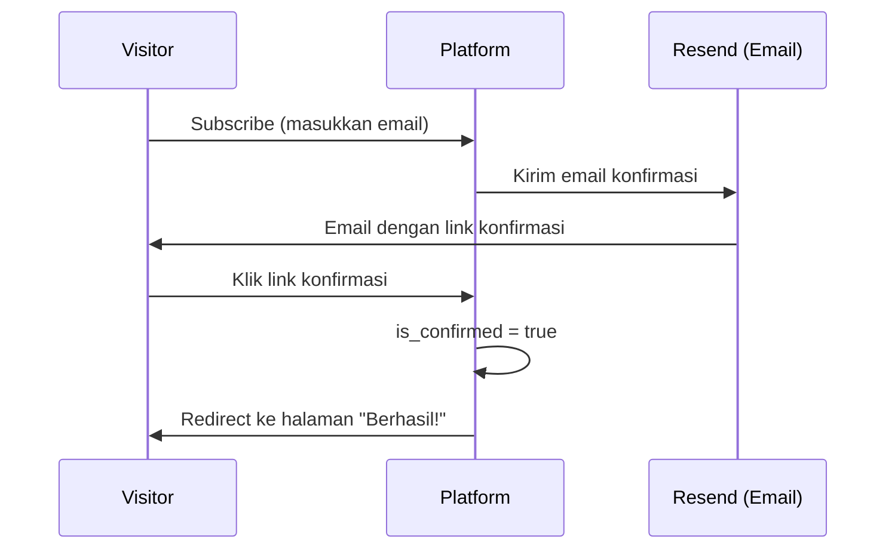

**Kelola newsletter dari CMS:**

1. Buat post dengan type `newsletter`
2. Tulis konten di rich text editor
3. Preview tampilan email
4. Pilih segment (semua subscriber / customer saja / worker saja)
5. Kirim atau jadwalkan
6. Lihat statistik: sent, opened, clicked

**Stats tracking:** Resend sudah punya built-in open/click tracking — data ditarik via Resend webhook dan disimpan di `cms_newsletter_sends`.

### 23.7 Fitur Admin CMS

**Dashboard CMS (di dalam admin panel):**

```
/admin/cms/
├── posts/           → Kelola semua artikel blog
│   ├── new          → Editor rich text baru
│   └── [id]/edit    → Edit post existing
├── pages/           → Halaman statis (FAQ, About, dll)
├── categories/      → Kategori blog
├── tags/            → Tag management
├── media/           → Media library
├── newsletter/
│   ├── subscribers  → List subscriber + status
│   └── sends        → Riwayat kirim + stats
├── redirects/       → SEO redirect manager
└── settings/        → Global site settings
```

**Fitur editor:**

- Autosave setiap 30 detik ke localStorage (prevent data loss)
- Toolbar floating saat teks diseleksi
- Slash command (`/heading`, `/image`, `/table`, `/callout`)
- Drag & drop reorder blok konten
- Full-screen mode
- Word count + estimasi waktu baca (otomatis dihitung)
- Diff view saat compare revisi

### 23.8 Global Site Settings

Key-value settings yang dikelola CMS dan dipakai seluruh platform:

| Key                 | Tipe    | Contoh                         |
| ------------------- | ------- | ------------------------------ |
| `site.name`         | string  | "JokiIn"                       |
| `site.tagline`      | string  | "Platform Tugas Terpercaya #1" |
| `site.logo_url`     | string  | URL logo                       |
| `site.favicon_url`  | string  | URL favicon                    |
| `site.og_image_url` | string  | Default OG image               |
| `social.instagram`  | string  | URL Instagram                  |
| `social.tiktok`     | string  | URL TikTok                     |
| `social.twitter`    | string  | URL Twitter/X                  |
| `footer.links`      | json    | Array link footer              |
| `announcement_bar`  | json    | Teks + warna banner pengumuman |
| `maintenance_mode`  | boolean | Aktifkan halaman maintenance   |

### 23.9 SEO Redirects Manager

Admin bisa kelola 301/302 redirect tanpa deploy ulang:

- Dari: `/blog/artikel-lama` → Ke: `/blog/artikel-baru` (301)
- Berguna saat slug artikel diubah atau kategori direstrukturisasi
- Redirect dicheck di Next.js middleware — tidak ada roundtrip ke server
- Import/export bulk via CSV

### 23.10 Non-Functional Requirements CMS

| Aspek              | Target                                              |
| ------------------ | --------------------------------------------------- |
| Page load blog     | < 1 detik (ISR + CDN)                               |
| Editor autosave    | Setiap 30 detik                                     |
| Media upload       | Max 10MB per file, format: jpg/png/webp/gif/mp4/pdf |
| Image optimization | Otomatis convert ke WebP via Cloudflare             |
| Max artikel        | Tidak terbatas                                      |
| Revisi history     | Simpan 50 revisi terakhir per post                  |
| Sitemap update     | Otomatis setiap post publish (max delay 5 menit)    |
