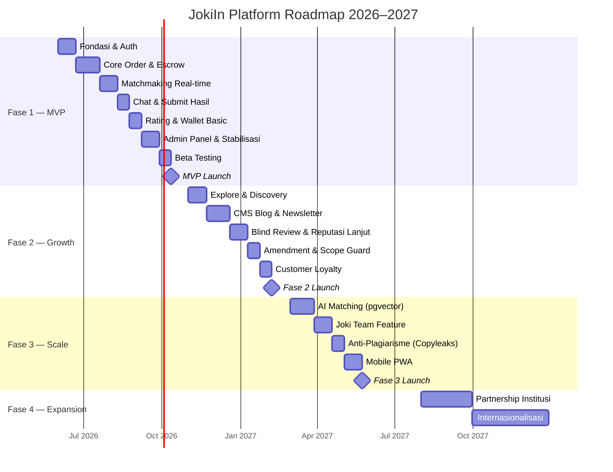
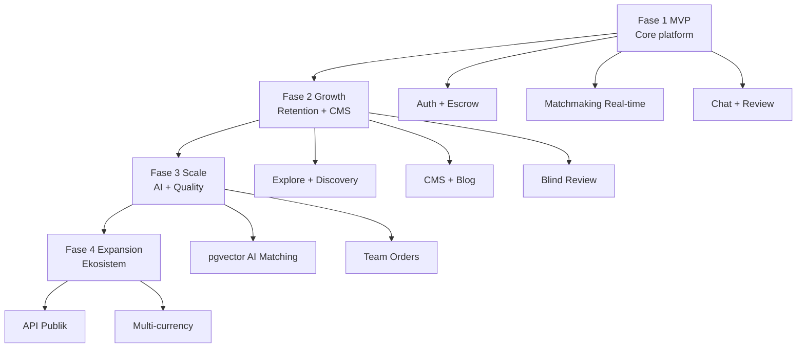

# Roadmap — JokiIn Platform

> Roadmap ini bersifat living document. Prioritas dapat berubah berdasarkan feedback pengguna dan data bisnis.

---

## Vision

Menjadi **platform task marketplace terpercaya #1 di Indonesia** dalam 2 tahun, dengan ekosistem yang adil dan transparan untuk customer dan worker.

---

## Status Legenda

| Status           | Simbol |
| ---------------- | ------ |
| Selesai          | ✅     |
| Dalam pengerjaan | 🔄     |
| Direncanakan     | 📋     |
| Dipertimbangkan  | 💭     |
| Dibatalkan       | ❌     |

---

## Overview Timeline

---

## Fase 1 — MVP (Juni–Oktober 2026)

**Goal:** Validasi core value proposition. Buktikan orang mau pakai sebelum build fitur kompleks.

**Target:** 200 customer, 30 worker aktif, 50 order selesai dalam 30 hari pertama.

### 1.1 Fondasi (Minggu 1–3)

- 📋 Setup monorepo (pnpm workspaces + Turborepo)
- 📋 Next.js 16 + Hono + Bun boilerplate
- 📋 Docker Compose (PostgreSQL 17 + Redis 8)
- 📋 Drizzle ORM schema + migrations semua tabel MVP
- 📋 Better Auth: register, login, logout, session management
- 📋 OTP WhatsApp via Fonnte
- 📋 CI/CD: GitHub Actions → Vercel + Railway
- 📋 Environment setup + `.env.example` lengkap
- 📋 Biome linting + TypeScript strict mode

### 1.2 Core Order & Escrow (Minggu 4–7)

- 📋 Form order terstruktur (semua field + validasi Zod)
- 📋 Integrasi AI (Groq/Mistral via Vercel AI SDK): analisis kesulitan → skor + harga minimum
- 📋 Validasi budget: warning jika di bawah minimum platform
- 📋 Midtrans Snap v3: inisiasi payment
- 📋 Webhook Midtrans dengan idempotency key + signature verification
- 📋 Escrow record otomatis setelah payment confirmed
- 📋 Kalkulasi komisi per badge level
- 📋 Transparansi biaya di UI sebelum checkout

### 1.3 Matchmaking Real-time (Minggu 8–10)

- 📋 BullMQ worker: broadcast order ke batch 1–3
- 📋 Socket.io server setup + Redis Pub/Sub adapter
- 📋 Algoritma eligibility filter (slot, spesialisasi, badge, deadline)
- 📋 Sorting berdasarkan reputation score + badge bonus
- 📋 Notifikasi order masuk ke worker (in-app + Web Push)
- 📋 Accept/tolak order dengan timer 5 menit
- 📋 Lock order ke worker pertama yang accept (race condition safe)
- 📋 Eskalasi batch otomatis jika tidak ada yang accept
- 📋 Notifikasi status broadcast real-time ke customer
- 📋 Emergency order: deadline < 3 jam + surge pricing 1.5×

### 1.4 Chat & Submit Hasil (Minggu 11–12)

- 📋 Chat per order (Socket.io room isolasi)
- 📋 Upload file di chat via Uploadthing → R2
- 📋 Auto-moderasi dasar: blokir nomor HP, email, link WA
- 📋 Countdown deadline real-time (client + server sync)
- 📋 BullMQ: deadline reminder H-6, H-2, H-30menit
- 📋 Submit hasil final (upload file + catatan)
- 📋 Watermark PDF otomatis (PDF-lib)
- 📋 Customer approve / request revisi / dispute
- 📋 Kalkulasi kuota revisi (difficulty × waktu pengerjaan)
- 📋 Auto-approve jika customer tidak respons dalam 2× waktu kerjakan
- 📋 Release escrow ke wallet worker (pending 48 jam)

### 1.5 Rating, Trust & Wallet (Minggu 13–14)

- 📋 Rating customer ke worker (3 dimensi: kualitas, komunikasi, waktu)
- 📋 Rating worker ke customer
- 📋 Kalkulasi overall rating
- 📋 Badge system 5 level dengan threshold
- 📋 Sistem penalti otomatis (cancel, telat, tidak submit)
- 📋 Strike counter + suspend otomatis ≥ 3 strike dalam 30 hari
- 📋 Verifikasi social media (flow kode unik di bio)
- 📋 Onboarding checklist worker dengan progress bar
- 📋 Wallet: saldo, pending, riwayat transaksi
- 📋 Request withdraw + OTP WhatsApp + penny test verification
- 📋 Proses withdraw T+1 hari kerja

### 1.6 Dashboard & Admin (Minggu 15–16)

- 📋 Dashboard customer: order aktif, riwayat, status
- 📋 Dashboard worker: earning, order, skor, grafik
- 📋 Admin panel (subdomain + IP whitelist)
- 📋 Admin: verifikasi worker (approve/reject + alasan)
- 📋 Admin: monitor semua order + force-complete/cancel
- 📋 Admin: queue dispute + resolusi
- 📋 Admin: kelola withdraw (approve/reject)
- 📋 Notifikasi email via Resend (konfirmasi, selesai, dispute)
- 📋 Novu orchestration setup

### 1.7 Stabilisasi & Launch (Minggu 17–20)

- 📋 Rate limiting semua endpoint critical (Redis)
- 📋 Sentry error tracking + Better Stack uptime
- 📋 Security audit: CSRF, HSTS, CSP, Helmet
- 📋 2FA opsional untuk worker, wajib untuk admin
- 📋 Halaman statis: FAQ, About, Cara Kerja (hardcoded dulu)
- 📋 Landing page basic + SEO meta tags
- 📋 Sitemap.xml otomatis
- 📋 ToS & Privacy Policy (UU PDP compliance)
- 📋 Playwright E2E tests: happy path order, payment, chat, withdraw
- 📋 Load testing: 500 concurrent users
- 📋 Beta testing: 100 customer + 20 worker terpilih
- 📋 Bug fixing sprint (7 hari)
- 📋 **🚀 Soft Launch MVP**

---

## Fase 2 — Growth (November 2026–Februari 2027)

**Goal:** Tingkatkan retention, trust, dan konten untuk SEO growth.

**Target:** 5.000 customer, 500 worker aktif, 3.000 order/bulan, GMV Rp 500jt/bulan.

### 2.1 Explore & Discovery

- 📋 Halaman explore worker dengan filter lengkap
- 📋 Sort: relevansi (rule-based), rating, harga, kecepatan
- 📋 Card worker: badge, rating, spesialisasi, response time
- 📋 Profil publik worker dengan portofolio
- 📋 Worker favorit + waiting list
- 📋 Direct hire (bypass broadcast ke worker favorit)
- 📋 Reorder 1 klik (duplikat order sebelumnya)
- 📋 Pencarian global (order, worker, kategori)

### 2.2 CMS Blog & Content

- 📋 Tiptap v3 rich text editor setup
- 📋 Media library (R2 upload + browser di admin)
- 📋 Blog CRUD + workflow draft → review → publish
- 📋 Category landing pages via CMS (sebelumnya hardcoded)
- 📋 Static pages editor (FAQ, About via CMS)
- 📋 Newsletter: subscriber double opt-in + kirim + stats
- 📋 SEO redirect manager (301/302 via admin)
- 📋 RSS feed `/blog/feed.xml`
- 📋 Scheduled publish
- 📋 Version history + rollback
- 📋 10 artikel blog awal + 1 landing page per kategori utama

### 2.3 Blind Review & Reputasi Lanjut

- 📋 Blind review system (keduanya submit dulu baru reveal)
- 📋 Weighted reputation score (5 komponen)
- 📋 Auto-update badge saat score naik/turun
- 📋 Warning sebelum badge turun (7 hari)
- 📋 Skor per kategori (bukan hanya global)
- 📋 Anti-manipulasi: deteksi pola rating mencurigakan
- 📋 Fast Responder badge (avg < 15 menit)

### 2.4 Amendment & Scope Guard

- 📋 Amendment system: perubahan scope/deadline/harga formal
- 📋 AI Scope Guard di chat (deteksi permintaan baru)
- 📋 Draft preview (watermarked) sebelum submit final
- 📋 Auto-moderasi chat lanjut: deteksi nomor rekening
- 📋 Amendment history visible di order timeline

### 2.5 Customer Loyalty & Monetisasi Lanjut

- 📋 Level customer: Pemula → Reguler → Setia → VIP
- 📋 Voucher system (percentage, fixed, cashback)
- 📋 Referral program: customer + worker
- 📋 Subscription worker Pro (Rp 99K/bulan, prioritas broadcast)
- 📋 Featured listing untuk worker (revenue tambahan)
- 📋 Voucher keadilan platform (kompensasi error sistem)

---

## Fase 3 — Scale (Maret–Juli 2027)

**Goal:** Skala nasional, tingkatkan kualitas matching, perluas use case.

**Target:** 50.000 customer, 5.000 worker aktif, 30.000 order/bulan, GMV Rp 5M/bulan.

### 3.1 AI Matching Lanjut

- 💭 pgvector: skill embedding untuk AI-powered matching
- 💭 Algoritma matching berbasis semantic similarity
- 💭 Rekomendasi worker personal berdasarkan history customer
- 💭 "Sering dipesan bersama" rekomendasi kategori

### 3.2 Joki Team Feature

- 💭 Order dikerjakan oleh tim 2–3 worker
- 💭 Worker lead bertanggung jawab ke customer
- 💭 Sistem bagi hasil internal antar anggota tim
- 💭 Customer hanya komunikasi dengan lead

### 3.3 Anti-Plagiarisme

- 💭 Integrasi Copyleaks API
- 💭 Cek otomatis sebelum submit (teks/essay, difficulty 3–5)
- 💭 Laporan plagiarisme → dispute system
- 💭 Badge "Original Work Verified" untuk worker

### 3.4 Mobile PWA

- 💭 Progressive Web App installable
- 💭 Push notification native (tidak hanya browser)
- 💭 Offline mode untuk baca chat history
- 💭 Camera upload (foto soal langsung dari HP)

### 3.5 Analytics Lanjut

- 💭 Dashboard analytics worker: heatmap jam, kategori terlaris
- 💭 Admin analytics: platform GMV, retention, cohort
- 💭 Pricing intelligence: rekomendasi harga optimal per kategori
- 💭 Fraud detection otomatis berbasis pattern

---

## Fase 4 — Expansion (Agustus 2027+)

**Goal:** Ekspansi ke institusi, internasional, dan ekosistem yang lebih luas.

### 4.1 Partnership Institusi

- 💭 Program kampus: worker terverifikasi dari institusi terpercaya
- 💭 API untuk integrasi dengan LMS kampus
- 💭 Paket enterprise untuk perusahaan (jasa konten, riset)
- 💭 White-label platform untuk partner

### 4.2 Internasionalisasi

- 💭 Multi-bahasa: Indonesia + English
- 💭 Multi-currency: IDR + USD + MYR
- 💭 Ekspansi Malaysia + Singapore (Melayu market)
- 💭 Payment gateway lokal per negara

### 4.3 Ekosistem Lanjut

- 💭 Marketplace template dan referensi tugas
- 💭 Konsultasi sebelum order (sesi tanya jawab berbayar)
- 💭 Kursus singkat dari worker expert
- 💭 API publik untuk developer (third-party integration)

---

## Metrics per Fase

| Metrik               | Fase 1 (30 hari) | Fase 2 (6 bulan) | Fase 3 (12 bulan) | Fase 4 (18 bulan) |
| -------------------- | ---------------- | ---------------- | ----------------- | ----------------- |
| Registered customers | 200              | 5.000            | 50.000            | 200.000           |
| Active workers       | 30               | 500              | 5.000             | 20.000            |
| Orders/bulan         | 50               | 3.000            | 30.000            | 120.000           |
| GMV/bulan            | Rp 25jt          | Rp 500jt         | Rp 5M             | Rp 20M            |
| Revenue platform     | Rp 3jt           | Rp 60jt          | Rp 600jt          | Rp 2,4M           |
| Order success rate   | > 80%            | > 88%            | > 92%             | > 95%             |
| Dispute rate         | < 15%            | < 8%             | < 4%              | < 2%              |
| Customer repeat rate | > 20%            | > 35%            | > 50%             | > 60%             |
| Avg match time       | < 15 menit       | < 8 menit        | < 5 menit         | < 3 menit         |
| NPS                  | > 20             | > 35             | > 50              | > 65              |

---

## Dependency Map

---

## Keputusan yang Ditunda (Parking Lot)

Fitur yang sudah dipikirkan tapi sengaja ditunda untuk dievaluasi berdasarkan data:

| Fitur                                 | Alasan Ditunda                                  |
| ------------------------------------- | ----------------------------------------------- |
| Mobile native app (iOS/Android)       | PWA cukup untuk fase awal, validasi dulu demand |
| Video call antara customer dan worker | Kompleksitas tinggi, use case terbatas          |
| Marketplace template tugas            | Perlu banyak konten dulu, butuh moderasi ekstra |
| Sistem escrow multi-mata uang         | Regulasi kompleks, tunggu Fase 4                |
| AI chatbot customer service           | Fokus dulu pada human support yang berkualitas  |
| Gamifikasi poin/leaderboard           | Bisa distorsi perilaku, evaluasi dulu di Fase 2 |

---

_Roadmap diupdate setiap akhir bulan oleh Product Team._

**Versi:** 1.0.0 | **Terakhir update:** 21 Mei 2026 | **Next review:** 21 Juni 2026
