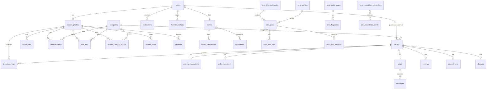

# Database Schema — JokiIn Platform

**Stack:** Drizzle ORM v1-beta + PostgreSQL 17 + pgvector
**Source of truth:** [`schema.ts`](./schema.ts)

## Daftar Isi

1. [Entity Relationship Diagram](#1-entity-relationship-diagram)
2. [Enums](#2-enums)
3. [Core Tables](#3-core-tables)
4. [Order & Matchmaking Tables](#4-order--matchmaking-tables)
5. [Payment & Wallet Tables](#5-payment--wallet-tables)
6. [Communication Tables](#6-communication-tables)
7. [Trust & Reputation Tables](#7-trust--reputation-tables)
8. [CMS Tables](#8-cms-tables)
9. [System Tables](#9-system-tables)
10. [Index Strategy](#10-index-strategy)
11. [Migration Guide](#11-migration-guide)

---

## 1. Entity Relationship Diagram



---

## 2. Enums

| Enum               | Values                                                                                                                                                                               | Digunakan di                 |
| ------------------ | ------------------------------------------------------------------------------------------------------------------------------------------------------------------------------------ | ---------------------------- |
| `user_role`        | `customer`, `worker`, `admin`, `super_admin`                                                                                                                                         | `users.role`                 |
| `badge_level`      | `SPROUT`, `SPARK`, `BLAZE`, `PRIME`, `APEX`                                                                                                                                          | `worker_profiles.badge`      |
| `order_status`     | `draft`, `pending_payment`, `broadcast`, `matched`, `in_progress`, `submitted`, `revision`, `disputed`, `completed`, `cancelled`, `refunded`                                         | `orders.status`              |
| `difficulty`       | `1`, `2`, `3`, `4`, `5`                                                                                                                                                              | `orders.difficulty_score`    |
| `escrow_status`    | `held`, `partially_released`, `released`, `refunded`, `disputed`                                                                                                                     | `escrow_transactions.status` |
| `withdraw_status`  | `pending`, `processing`, `completed`, `failed`, `rejected`                                                                                                                           | `withdrawals.status`         |
| `penalty_type`     | `cancel_before_start`, `cancel_mid_work`, `late_under_30min`, `late_over_30min`, `no_submission`, `rating_manipulation`, `scope_violation`, `external_contact_attempt`               | `penalties.type`             |
| `amendment_status` | `pending`, `approved`, `rejected`                                                                                                                                                    | `amendments.status`          |
| `audit_action`     | `escrow_hold`, `escrow_release`, `escrow_refund`, `penalty_applied`, `user_suspended`, `user_banned`, `dispute_opened`, `dispute_resolved`, `withdrawal_processed`, `admin_override` | `audit_logs.action`          |
| `cms_post_status`  | `draft`, `review`, `published`, `archived`                                                                                                                                           | `cms_posts.status`           |
| `cms_page_type`    | `blog`, `static`, `category_landing`, `newsletter`                                                                                                                                   | `cms_posts.type`             |
| `cms_media_type`   | `image`, `video`, `document`, `og_image`                                                                                                                                             | `cms_media.type`             |

---

## 3. Core Tables

### `users`

Tabel utama untuk semua pengguna platform. Customer, worker, dan admin semua ada di sini dengan `role` yang membedakan.

| Kolom             | Tipe         | Nullable | Default    | Deskripsi                      |
| ----------------- | ------------ | -------- | ---------- | ------------------------------ |
| `id`              | uuid         | No       | random     | Primary key                    |
| `role`            | user_role    | No       | `customer` | Role pengguna                  |
| `email`           | varchar(255) | No       | —          | Email unik                     |
| `phone`           | varchar(20)  | Yes      | —          | Nomor HP untuk OTP             |
| `password_hash`   | text         | Yes      | —          | Argon2 hash                    |
| `display_name`    | varchar(100) | No       | —          | Nama tampil (bisa alias)       |
| `avatar_url`      | text         | Yes      | —          | URL foto profil                |
| `is_anonymous`    | boolean      | No       | false      | Sembunyikan nama asli (worker) |
| `is_verified`     | boolean      | No       | false      | Sudah verifikasi email/HP      |
| `is_suspended`    | boolean      | No       | false      | Akun di-suspend sementara      |
| `is_banned`       | boolean      | No       | false      | Akun di-ban permanen           |
| `suspended_until` | timestamp    | Yes      | —          | Batas waktu suspend            |
| `trust_score`     | smallint     | No       | 0          | Akumulasi poin validasi sosial |
| `customer_score`  | decimal(4,2) | Yes      | 100.00     | Skor perilaku customer (0–100) |
| `customer_level`  | varchar(20)  | Yes      | `Pemula`   | Level loyalty customer         |
| `total_orders`    | integer      | No       | 0          | Total order sebagai customer   |
| `created_at`      | timestamp    | No       | now()      | Waktu registrasi               |
| `updated_at`      | timestamp    | No       | now()      | Last update                    |
| `last_active_at`  | timestamp    | Yes      | —          | Terakhir aktif                 |
| `deleted_at`      | timestamp    | Yes      | —          | Soft delete (UU PDP)           |
| `metadata`        | jsonb        | No       | `{}`       | Data tambahan fleksibel        |

**Indexes:** `users_email_idx` (unique), `users_phone_idx`, `users_role_idx`

---

### `worker_profiles`

Profil extended untuk user dengan role `worker`. One-to-one dengan `users`.

| Kolom                   | Tipe          | Nullable | Default    | Deskripsi                           |
| ----------------------- | ------------- | -------- | ---------- | ----------------------------------- |
| `id`                    | uuid          | No       | random     | Primary key                         |
| `user_id`               | uuid          | No       | —          | FK → `users.id`                     |
| `badge`                 | badge_level   | No       | `SPROUT`   | Level badge saat ini                |
| `reputation_score`      | decimal(5,2)  | Yes      | 50.00      | Skor reputasi weighted (0–100)      |
| `rating_score`          | decimal(3,2)  | Yes      | 0.00       | Komponen: rata-rata rating customer |
| `completion_rate`       | decimal(5,2)  | Yes      | 0.00       | Komponen: % order selesai           |
| `deadline_score`        | decimal(5,2)  | Yes      | 0.00       | Komponen: % tepat deadline          |
| `response_rate`         | decimal(5,2)  | Yes      | 0.00       | Komponen: % respons broadcast       |
| `repeat_customer_rate`  | decimal(5,2)  | Yes      | 0.00       | Komponen: % repeat customer         |
| `avg_response_minutes`  | integer       | Yes      | 0          | Rata-rata menit respons (30 hari)   |
| `max_active_orders`     | smallint      | No       | 3          | Maks order aktif bersamaan          |
| `current_active_orders` | integer       | No       | 0          | Order aktif saat ini                |
| `is_online`             | boolean       | No       | false      | Status online                       |
| `is_on_leave`           | boolean       | No       | false      | Mode libur manual                   |
| `active_hours_start`    | varchar(5)    | Yes      | `08:00`    | Jam mulai aktif (WIB)               |
| `active_hours_end`      | varchar(5)    | Yes      | `22:00`    | Jam selesai aktif (WIB)             |
| `active_days`           | jsonb         | Yes      | semua hari | Hari aktif dalam seminggu           |
| `total_completed`       | integer       | No       | 0          | Total order selesai                 |
| `total_earnings`        | decimal(14,2) | Yes      | 0.00       | Total penghasilan lifetime          |
| `strike_count`          | smallint      | No       | 0          | Jumlah strike aktif                 |
| `is_pro`                | boolean       | No       | false      | Subscription Pro aktif              |
| `pro_expires_at`        | timestamp     | Yes      | —          | Batas waktu Pro                     |
| `bio`                   | text          | Yes      | —          | Deskripsi diri                      |

**Indexes:** `worker_profiles_user_idx` (unique), `worker_profiles_badge_idx`, `worker_profiles_reputation_idx`, `worker_profiles_online_idx`

---

### `categories`

Hierarki kategori layanan. Support parent-child (Matematika → Kalkulus).

| Kolom                  | Tipe          | Nullable | Default | Deskripsi                         |
| ---------------------- | ------------- | -------- | ------- | --------------------------------- |
| `id`                   | uuid          | No       | random  | Primary key                       |
| `parent_id`            | uuid          | Yes      | —       | FK self-referential (subkategori) |
| `name`                 | varchar(100)  | No       | —       | Nama kategori                     |
| `slug`                 | varchar(100)  | No       | —       | URL-friendly slug                 |
| `icon`                 | varchar(50)   | Yes      | —       | Nama icon (Lucide/emoji)          |
| `base_difficulty_min`  | smallint      | No       | 1       | Difficulty minimum kategori ini   |
| `base_difficulty_max`  | smallint      | No       | 5       | Difficulty maximum kategori ini   |
| `min_price_per_page`   | decimal(10,2) | Yes      | —       | Harga minimum per halaman/soal    |
| `estimated_hours_base` | decimal(5,2)  | Yes      | —       | Estimasi jam base untuk AI        |
| `is_active`            | boolean       | No       | true    | Aktif di platform                 |
| `sort_order`           | smallint      | Yes      | 0       | Urutan tampil di UI               |

---

## 4. Order & Matchmaking Tables

### `orders`

Tabel utama transaksi. Deskripsi dan scope dikunci setelah worker accept.

| Kolom                  | Tipe          | Deskripsi                                       |
| ---------------------- | ------------- | ----------------------------------------------- |
| `id`                   | uuid          | Primary key                                     |
| `order_number`         | varchar(20)   | Format: `ORD-20260521-XXXX` (unique)            |
| `customer_id`          | uuid          | FK → `users.id`                                 |
| `worker_id`            | uuid          | FK → `worker_profiles.id` (null sampai matched) |
| `category_id`          | uuid          | FK → `categories.id`                            |
| `status`               | order_status  | Status order saat ini                           |
| `title`                | varchar(300)  | Judul tugas                                     |
| `description`          | text          | Deskripsi detail (terkunci setelah matched)     |
| `output_format`        | varchar(50)   | Word / PDF / PPT / Code / Other                 |
| `page_count`           | smallint      | Jumlah halaman/soal                             |
| `additional_notes`     | text          | Catatan tambahan                                |
| `forbidden_items`      | text          | Hal yang tidak boleh ada di hasil               |
| `attachment_urls`      | jsonb         | Array URL lampiran customer                     |
| `difficulty_score`     | difficulty    | Skor 1–5 dari AI                                |
| `ai_analysis`          | jsonb         | Full response AI (estimasi, harga, warnings)    |
| `estimated_hours`      | decimal(5,2)  | Estimasi jam pengerjaan dari AI                 |
| `customer_budget`      | decimal(12,2) | Budget yang di-set customer                     |
| `platform_min_price`   | decimal(12,2) | Harga minimum dari AI                           |
| `agreed_price`         | decimal(12,2) | Harga yang disepakati saat order dibuat         |
| `platform_fee`         | decimal(12,2) | Komisi platform (% dari agreed_price)           |
| `worker_earnings`      | decimal(12,2) | Yang diterima worker (agreed - fee)             |
| `customer_deadline`    | timestamp     | Deadline dari customer                          |
| `worker_deadline`      | timestamp     | customer_deadline - 1 jam buffer                |
| `started_at`           | timestamp     | Saat worker mulai kerjakan                      |
| `submitted_at`         | timestamp     | Saat worker submit hasil                        |
| `completed_at`         | timestamp     | Saat order selesai (approve/auto-approve)       |
| `auto_approve_at`      | timestamp     | Deadline auto-approve (set saat submit)         |
| `max_revisions`        | smallint      | Kuota revisi gratis (kalkulasi AI)              |
| `used_revisions`       | smallint      | Revisi yang sudah dipakai                       |
| `broadcast_batch`      | smallint      | Batch broadcast saat ini                        |
| `broadcast_expires_at` | timestamp     | Batas waktu batch saat ini                      |
| `is_emergency`         | boolean       | Deadline < 3 jam (surge pricing)                |
| `is_exclusive`         | boolean       | Direct hire ke worker tertentu                  |
| `is_secret`            | boolean       | Tidak tampil di history publik                  |
| `cancelled_by_id`      | uuid          | Siapa yang cancel                               |
| `cancel_reason`        | text          | Alasan cancel (wajib)                           |
| `cancel_category`      | varchar(50)   | Kategori alasan cancel                          |

**Indexes:** order_number (unique), customer_id, worker_id, status, customer_deadline, (category_id + status)

---

### `order_milestones`

Untuk tugas panjang (> 3 hari) dengan pembayaran bertahap.

| Kolom             | Tipe          | Deskripsi                              |
| ----------------- | ------------- | -------------------------------------- |
| `id`              | uuid          | Primary key                            |
| `order_id`        | uuid          | FK → `orders.id`                       |
| `milestone_no`    | smallint      | Nomor urut (1, 2)                      |
| `title`           | varchar(100)  | Nama milestone                         |
| `release_percent` | smallint      | Persentase dana dilepas (30 atau 70)   |
| `amount`          | decimal(12,2) | Nominal Rupiah                         |
| `is_released`     | boolean       | Sudah dilepas ke wallet?               |
| `file_urls`       | jsonb         | File yang disubmit untuk milestone ini |
| `submitted_at`    | timestamp     | Waktu submit                           |
| `approved_at`     | timestamp     | Waktu customer approve                 |

---

### `broadcast_logs`

Log setiap notifikasi order yang dikirim ke worker (untuk audit dan analitik matchmaking).

| Kolom          | Tipe        | Deskripsi                           |
| -------------- | ----------- | ----------------------------------- |
| `id`           | uuid        | Primary key                         |
| `order_id`     | uuid        | FK → `orders.id`                    |
| `worker_id`    | uuid        | FK → `worker_profiles.id`           |
| `batch_number` | smallint    | Batch ke-berapa                     |
| `sent_at`      | timestamp   | Waktu notif dikirim                 |
| `seen_at`      | timestamp   | Waktu worker buka notif             |
| `responded_at` | timestamp   | Waktu worker respons                |
| `response`     | varchar(10) | `accepted` / `rejected` / `ignored` |

---

### `amendments`

Perubahan scope/deadline/harga formal setelah order berjalan. Semua perubahan HARUS lewat sini.

| Kolom                  | Tipe             | Deskripsi                                        |
| ---------------------- | ---------------- | ------------------------------------------------ |
| `id`                   | uuid             | Primary key                                      |
| `order_id`             | uuid             | FK → `orders.id`                                 |
| `requested_by_id`      | uuid             | Siapa yang ajukan                                |
| `status`               | amendment_status | pending / approved / rejected                    |
| `change_type`          | varchar(30)      | `scope` / `deadline` / `price`                   |
| `description`          | text             | Detail perubahan yang diminta                    |
| `price_delta`          | decimal(12,2)    | Penambahan/pengurangan harga                     |
| `deadline_delta_hours` | integer          | Penambahan/pengurangan jam deadline              |
| `approved_by_id`       | uuid             | Siapa yang approve                               |
| `expires_at`           | timestamp        | 24 jam setelah dibuat — auto-rejected jika lewat |

---

### `disputes`

Sengketa antara customer dan worker. Dana ditahan selama dispute berlangsung.

| Kolom            | Tipe          | Deskripsi                                             |
| ---------------- | ------------- | ----------------------------------------------------- |
| `id`             | uuid          | Primary key                                           |
| `order_id`       | uuid          | FK → `orders.id` (unique — 1 dispute per order)       |
| `opened_by_id`   | uuid          | Customer atau worker yang buka                        |
| `reason`         | varchar(50)   | Kategori alasan dispute                               |
| `description`    | text          | Detail situasi                                        |
| `evidence_urls`  | jsonb         | Array URL bukti (screenshot, file)                    |
| `status`         | varchar(20)   | `open` / `reviewing` / `resolved`                     |
| `resolution`     | varchar(30)   | `refund_full` / `refund_partial` / `release` / `redo` |
| `resolved_by_id` | uuid          | Admin yang menyelesaikan                              |
| `resolved_note`  | text          | Catatan keputusan admin (wajib min 50 char)           |
| `refund_amount`  | decimal(12,2) | Nominal refund jika partial                           |

---

## 5. Payment & Wallet Tables

### `escrow_transactions`

Satu record per order. Memegang dana customer dari bayar sampai release.

| Kolom                 | Tipe          | Deskripsi                                   |
| --------------------- | ------------- | ------------------------------------------- |
| `id`                  | uuid          | Primary key                                 |
| `order_id`            | uuid          | FK → `orders.id` (unique)                   |
| `status`              | escrow_status | Status escrow saat ini                      |
| `total_amount`        | decimal(14,2) | Total yang dibayar customer                 |
| `platform_fee`        | decimal(14,2) | Komisi platform                             |
| `worker_amount`       | decimal(14,2) | Yang akan diterima worker                   |
| `refund_amount`       | decimal(14,2) | Yang dikembalikan ke customer               |
| `midtrans_order_id`   | varchar(100)  | ID transaksi Midtrans                       |
| `midtrans_payment_id` | varchar(100)  | ID payment Midtrans                         |
| `payment_method`      | varchar(50)   | qris / bank_transfer / gopay / ovo / dana   |
| `idempotency_key`     | varchar(100)  | Untuk cegah double-process webhook (unique) |
| `webhook_payload`     | jsonb         | Raw payload dari Midtrans                   |

---

### `wallets`

Saldo internal worker. Semua earning dari order masuk ke sini sebelum bisa di-withdraw.

| Kolom                 | Tipe          | Deskripsi                            |
| --------------------- | ------------- | ------------------------------------ |
| `id`                  | uuid          | Primary key                          |
| `user_id`             | uuid          | FK → `users.id` (unique)             |
| `balance`             | decimal(14,2) | Saldo tersedia untuk withdraw        |
| `pending_balance`     | decimal(14,2) | Saldo dalam masa garansi 48 jam      |
| `total_earned`        | decimal(14,2) | Total penghasilan lifetime           |
| `total_withdrawn`     | decimal(14,2) | Total yang sudah di-withdraw         |
| `bank_name`           | varchar(50)   | Nama bank terdaftar                  |
| `bank_account_number` | varchar(30)   | Nomor rekening (penny test verified) |
| `bank_account_name`   | varchar(100)  | Nama pemilik rekening                |
| `is_bank_verified`    | boolean       | Sudah lewat penny test?              |
| `bank_verified_at`    | timestamp     | Waktu verifikasi berhasil            |

---

### `wallet_transactions`

Ledger immutable semua mutasi saldo. Setiap perubahan balance tercatat.

| Kolom            | Tipe          | Deskripsi                                  |
| ---------------- | ------------- | ------------------------------------------ |
| `id`             | uuid          | Primary key                                |
| `wallet_id`      | uuid          | FK → `wallets.id`                          |
| `order_id`       | uuid          | FK → `orders.id` (null untuk withdraw)     |
| `type`           | varchar(30)   | `credit` / `debit` / `pending` / `release` |
| `amount`         | decimal(14,2) | Nominal transaksi                          |
| `balance_before` | decimal(14,2) | Saldo sebelum transaksi                    |
| `balance_after`  | decimal(14,2) | Saldo setelah transaksi                    |
| `description`    | text          | Keterangan transaksi                       |

---

### `withdrawals`

Request penarikan dana dari wallet ke rekening bank.

| Kolom                 | Tipe            | Deskripsi                           |
| --------------------- | --------------- | ----------------------------------- |
| `id`                  | uuid            | Primary key                         |
| `wallet_id`           | uuid            | FK → `wallets.id`                   |
| `user_id`             | uuid            | FK → `users.id`                     |
| `amount`              | decimal(14,2)   | Nominal yang diminta                |
| `admin_fee`           | decimal(14,2)   | Biaya admin (Rp 0–5.000)            |
| `net_amount`          | decimal(14,2)   | Yang diterima worker (amount - fee) |
| `status`              | withdraw_status | Status proses                       |
| `bank_name`           | varchar(50)     | Bank tujuan                         |
| `bank_account_number` | varchar(30)     | Nomor rekening tujuan               |
| `bank_account_name`   | varchar(100)    | Nama pemilik rekening               |
| `otp_verified`        | boolean         | OTP WhatsApp sudah diverifikasi     |
| `idempotency_key`     | varchar(100)    | Prevent double-process (unique)     |
| `failure_reason`      | text            | Alasan gagal jika status = failed   |

---

## 6. Communication Tables

### `chats`

Satu chat room per order. Aktif dari order matched sampai selesai + 7 hari.

| Kolom         | Tipe    | Deskripsi                           |
| ------------- | ------- | ----------------------------------- |
| `id`          | uuid    | Primary key                         |
| `order_id`    | uuid    | FK → `orders.id` (unique)           |
| `customer_id` | uuid    | FK → `users.id`                     |
| `worker_id`   | uuid    | FK → `users.id`                     |
| `is_locked`   | boolean | true setelah order selesai + 7 hari |

---

### `messages`

Semua pesan dalam chat. Tersimpan permanen sebagai bukti untuk dispute.

| Kolom               | Tipe         | Deskripsi                          |
| ------------------- | ------------ | ---------------------------------- |
| `id`                | uuid         | Primary key                        |
| `chat_id`           | uuid         | FK → `chats.id`                    |
| `sender_id`         | uuid         | FK → `users.id`                    |
| `content`           | text         | Isi pesan teks                     |
| `file_urls`         | jsonb        | Array URL file yang dilampirkan    |
| `message_type`      | varchar(20)  | `text` / `file` / `system`         |
| `is_flagged`        | boolean      | Di-flag oleh sistem moderasi       |
| `flag_reason`       | varchar(100) | Alasan flag                        |
| `is_system_message` | boolean      | Pesan otomatis sistem (bukan user) |
| `read_at`           | timestamp    | Waktu dibaca penerima              |

---

### `notifications`

Semua notifikasi in-app. Channel lain (WA, email, push) dikelola Novu.

| Kolom     | Tipe         | Deskripsi                                           |
| --------- | ------------ | --------------------------------------------------- |
| `id`      | uuid         | Primary key                                         |
| `user_id` | uuid         | FK → `users.id`                                     |
| `type`    | varchar(50)  | Tipe notif (`order_broadcast`, `chat_message`, dll) |
| `title`   | varchar(200) | Judul notifikasi                                    |
| `body`    | text         | Isi notifikasi                                      |
| `data`    | jsonb        | Data tambahan (orderId, dll) untuk deep link        |
| `channel` | varchar(20)  | `in_app` / `whatsapp` / `email` / `push`            |
| `is_read` | boolean      | Sudah dibaca?                                       |

---

## 7. Trust & Reputation Tables

### `social_links`

Social media terverifikasi worker. Digunakan untuk menghitung `trust_score` awal.

| Kolom              | Tipe         | Deskripsi                                                              |
| ------------------ | ------------ | ---------------------------------------------------------------------- |
| `id`               | uuid         | Primary key                                                            |
| `worker_id`        | uuid         | FK → `worker_profiles.id`                                              |
| `platform`         | varchar(30)  | `linkedin` / `github` / `instagram` / `tiktok` / `youtube` / `behance` |
| `url`              | text         | URL profil publik                                                      |
| `username`         | varchar(100) | Username di platform tersebut                                          |
| `is_verified`      | boolean      | Sudah diverifikasi via kode unik                                       |
| `follower_count`   | integer      | Jumlah follower/koneksi                                                |
| `account_age_days` | integer      | Umur akun dalam hari                                                   |
| `trust_points`     | smallint     | Poin kontribusi ke trust_score                                         |
| **Unique**         |              | `(worker_id, platform)` — satu platform per worker                     |

---

### `reviews`

Blind review system. Kedua pihak submit tanpa tahu nilai satu sama lain dulu.

| Kolom                | Tipe         | Deskripsi                         |
| -------------------- | ------------ | --------------------------------- |
| `id`                 | uuid         | Primary key                       |
| `order_id`           | uuid         | FK → `orders.id` (unique)         |
| `customer_submitted` | boolean      | Customer sudah submit?            |
| `worker_submitted`   | boolean      | Worker sudah submit?              |
| `is_revealed`        | boolean      | Kedua rating sudah ditampilkan    |
| `quality_rating`     | smallint     | 1–5: kualitas hasil kerja         |
| `comm_rating`        | smallint     | 1–5: komunikasi selama order      |
| `time_rating`        | smallint     | 1–5: ketepatan waktu              |
| `overall_rating`     | decimal(3,2) | Rata-rata ketiga dimensi          |
| `customer_comment`   | text         | Ulasan teks dari customer         |
| `result_match_desc`  | boolean      | Apakah hasil sesuai deskripsi?    |
| `would_use_again`    | boolean      | Mau pakai worker ini lagi?        |
| `customer_rating`    | smallint     | 1–5: rating worker untuk customer |
| `worker_comment`     | text         | Komentar worker untuk customer    |
| `reveal_at`          | timestamp    | Waktu otomatis reveal             |

---

### `penalties`

Penalti yang diterapkan ke worker. Dipakai untuk menghitung reputasi dan strike.

| Kolom            | Tipe         | Deskripsi                                     |
| ---------------- | ------------ | --------------------------------------------- |
| `id`             | uuid         | Primary key                                   |
| `worker_id`      | uuid         | FK → `worker_profiles.id`                     |
| `order_id`       | uuid         | FK → `orders.id` (null jika bukan dari order) |
| `type`           | penalty_type | Jenis pelanggaran                             |
| `point_deducted` | smallint     | Poin reputasi yang dikurangi                  |
| `strikes_added`  | smallint     | Strike yang ditambah                          |
| `reason`         | text         | Penjelasan detail                             |
| `applied_by_id`  | uuid         | Admin yang apply (null = sistem otomatis)     |

---

### `audit_logs`

Log semua aksi kritis yang tidak bisa dihapus. Dibutuhkan untuk compliance dan dispute.

| Kolom         | Tipe         | Deskripsi                                  |
| ------------- | ------------ | ------------------------------------------ |
| `id`          | uuid         | Primary key                                |
| `action`      | audit_action | Jenis aksi                                 |
| `actor_id`    | uuid         | Siapa yang melakukan (null = sistem)       |
| `target_id`   | uuid         | ID objek yang dikenai aksi                 |
| `target_type` | varchar(30)  | `order` / `user` / `escrow` / `withdrawal` |
| `before`      | jsonb        | State sebelum perubahan                    |
| `after`       | jsonb        | State setelah perubahan                    |
| `ip_address`  | varchar(45)  | IP address aktor (IPv4/IPv6)               |

---

## 8. CMS Tables

### `cms_posts`

Tabel utama konten. Menampung semua tipe: blog, static pages, category landing, newsletter.

| Kolom                 | Tipe            | Deskripsi                                     |
| --------------------- | --------------- | --------------------------------------------- |
| `id`                  | uuid            | Primary key                                   |
| `type`                | cms_page_type   | Tipe konten                                   |
| `status`              | cms_post_status | Status editorial                              |
| `author_id`           | uuid            | FK → `cms_authors.id`                         |
| `category_id`         | uuid            | FK → `cms_blog_categories.id`                 |
| `title`               | varchar(200)    | Judul konten                                  |
| `slug`                | varchar(200)    | URL slug (unique)                             |
| `excerpt`             | text            | Ringkasan untuk card & meta                   |
| `content`             | jsonb           | Konten Tiptap format JSON                     |
| `content_html`        | text            | Pre-rendered HTML untuk performa              |
| `cover_image_id`      | uuid            | FK → `cms_media.id`                           |
| `reading_time_min`    | smallint        | Estimasi menit baca (auto-hitung)             |
| `meta_title`          | varchar(60)     | SEO title (max 60 char)                       |
| `meta_description`    | varchar(160)    | SEO description (max 160 char)                |
| `og_image_id`         | uuid            | FK → `cms_media.id` (Open Graph image)        |
| `canonical_url`       | text            | Untuk konten yang republish                   |
| `schema_type`         | varchar(30)     | `Article` / `FAQPage` / `HowTo`               |
| `schema_data`         | jsonb           | JSON-LD structured data                       |
| `service_category_id` | uuid            | FK → `categories.id` (untuk category landing) |
| `view_count`          | integer         | Total pageview                                |
| `published_at`        | timestamp       | Waktu publish                                 |
| `scheduled_at`        | timestamp       | Waktu publish terjadwal                       |
| `deleted_at`          | timestamp       | Soft delete                                   |

---

### `cms_media`

Media library terpusat. Semua file disimpan di Cloudflare R2.

| Kolom         | Tipe           | Deskripsi                            |
| ------------- | -------------- | ------------------------------------ |
| `id`          | uuid           | Primary key                          |
| `uploaded_by` | uuid           | FK → `users.id`                      |
| `type`        | cms_media_type | Tipe media                           |
| `file_name`   | varchar(255)   | Nama file asli                       |
| `file_url`    | text           | URL R2 publik                        |
| `file_size`   | integer        | Ukuran dalam bytes                   |
| `mime_type`   | varchar(100)   | MIME type (image/webp, dll)          |
| `width`       | integer        | Lebar dalam px (untuk gambar)        |
| `height`      | integer        | Tinggi dalam px (untuk gambar)       |
| `alt_text`    | text           | Alt text wajib (aksesibilitas + SEO) |
| `caption`     | text           | Caption opsional                     |
| `folder`      | varchar(100)   | Folder organisasi di library         |

---

### `cms_newsletter_subscribers`

Email subscriber dengan double opt-in untuk memastikan valid.

| Kolom             | Tipe         | Deskripsi                                            |
| ----------------- | ------------ | ---------------------------------------------------- |
| `id`              | uuid         | Primary key                                          |
| `email`           | varchar(255) | Email (unique)                                       |
| `name`            | varchar(100) | Nama subscriber                                      |
| `user_id`         | uuid         | FK → `users.id` (null = guest)                       |
| `is_confirmed`    | boolean      | Sudah klik link konfirmasi?                          |
| `confirm_token`   | varchar(100) | Token untuk link konfirmasi                          |
| `confirmed_at`    | timestamp    | Waktu konfirmasi                                     |
| `unsubscribed_at` | timestamp    | Waktu unsubscribe                                    |
| `source`          | varchar(50)  | Dari mana subscribe: `blog` / `landing` / `register` |

---

### `cms_seo_redirects`

Kelola 301/302 redirect tanpa deploy ulang.

| Kolom         | Tipe         | Deskripsi                                |
| ------------- | ------------ | ---------------------------------------- |
| `id`          | uuid         | Primary key                              |
| `from_path`   | varchar(500) | Path asal (unique)                       |
| `to_path`     | varchar(500) | Path tujuan                              |
| `status_code` | smallint     | `301` (permanent) atau `302` (temporary) |
| `is_active`   | boolean      | Aktif atau tidak                         |

---

### `cms_settings`

Key-value store untuk konfigurasi global platform.

| Key                 | Value Type | Contoh                          |
| ------------------- | ---------- | ------------------------------- |
| `site.name`         | string     | `"JokiIn"`                      |
| `site.tagline`      | string     | `"Platform Tugas #1 Indonesia"` |
| `site.logo_url`     | string     | URL logo                        |
| `site.og_image_url` | string     | Default OG image URL            |
| `social.instagram`  | string     | URL Instagram                   |
| `social.tiktok`     | string     | URL TikTok                      |
| `social.twitter`    | string     | URL Twitter/X                   |
| `footer.links`      | array      | `[{label, url}]`                |
| `announcement_bar`  | object     | `{text, color, is_active}`      |
| `maintenance_mode`  | boolean    | `false`                         |

---

## 9. System Tables

### `vouchers` & `voucher_usages`

Sistem diskon dan promo. Support percentage, fixed amount, dan cashback.

### `referrals`

Referral program — customer atau worker ajak orang baru, dapat bonus.

### `waiting_list`

Customer yang mau tunggu worker favorit yang sedang penuh slot-nya.

### `favorite_workers`

Many-to-many customer ↔ worker yang difavoritkan.

### `worker_notes`

Catatan pribadi worker tentang customer tertentu — tidak terlihat customer.

---

## 10. Index Strategy

### Critical Indexes

```sql
-- Matchmaking query (paling sering dipanggil)
CREATE INDEX orders_category_status_idx ON orders (category_id, status);
CREATE INDEX worker_profiles_online_idx ON worker_profiles (is_online);
CREATE INDEX worker_profiles_reputation_idx ON worker_profiles (reputation_score DESC);

-- Chat queries
CREATE INDEX messages_chat_idx ON messages (chat_id);

-- Audit & compliance
CREATE INDEX audit_logs_time_idx ON audit_logs (created_at DESC);

-- CMS SEO
CREATE INDEX cms_posts_type_status_idx ON cms_posts (type, status);
CREATE INDEX cms_posts_published_at_idx ON cms_posts (published_at DESC);
```

### Unique Constraints

```sql
users_email_idx                     -- Satu email per user
escrow_transactions_idempotency_idx -- Cegah double-process webhook
withdrawals_idempotency_idx         -- Cegah double-withdraw
chats_order_idx                     -- Satu chat per order
reviews_order_idx                   -- Satu review per order
disputes_order_idx                  -- Satu dispute per order
cms_posts_slug_idx                  -- Slug unik per konten
```

---

## 11. Migration Guide

### Setup

```bash
# Generate migration dari schema.ts
bun run db:generate

# Jalankan migration
bun run db:migrate

# Lihat status migration
bun run db:status

# Rollback 1 migration
bun run db:rollback
```

### `packages/db/drizzle.config.ts`

```typescript
import { defineConfig } from "drizzle-kit";

export default defineConfig({
  schema: "./schema.ts",
  out: "./migrations",
  dialect: "postgresql",
  dbCredentials: {
    url: process.env.DATABASE_URL!,
  },
  verbose: true,
  strict: true,
});
```

### Naming Convention

| Objek        | Convention              | Contoh                                |
| ------------ | ----------------------- | ------------------------------------- |
| Tabel        | `snake_case` plural     | `worker_profiles`, `order_milestones` |
| Kolom        | `snake_case`            | `created_at`, `worker_id`             |
| TS variable  | `camelCase`             | `workerProfiles`, `orderMilestones`   |
| Index        | `{table}_{col}_idx`     | `orders_status_idx`                   |
| Unique index | `{table}_{col}_idx`     | `users_email_idx`                     |
| FK           | `{referenced_table}_id` | `worker_id`, `category_id`            |
| Enum         | `snake_case`            | `order_status`, `badge_level`         |

---

_Source of truth selalu di [`schema.ts`](./schema.ts) — dokumen ini adalah dokumentasi human-readable._

**Versi:** 1.0.0 | **Tanggal:** 21 Mei 2026
